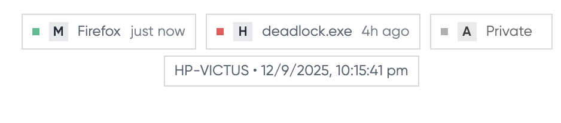

I started by [building a live device feed for my website](/posts/building-live-device-feed/), but then I realized that showing live status of what I'm currently viewing might not be good for my privacy. Even though I made it near real-time with a 5-minute delta, I realized that any malicious user could CRON the API and figure out my patterns. And if I tackled this by introducing more lag, it would defeat the purpose of showing what I'm actively using. That's when I realized I needed a better solution.

## A Celestial Refactor

I wanted something that offered a more meaningful summary of my digital life—a visualization that could show the rhythm of my work, not just a single heartbeat. This is where the concept of the "Digital Constellation" was born.

Instead of showing a moment in real time, the constellation visualizes entire work sessions, creating an insightful narrative without exposing privacy. It shifts the focus from "what am I doing now?" to "what have I been focused on recently?" This approach feels more honest, more artistic, and ultimately, more representative of how I spend my time.

## Decoding the Digital Cosmos

The constellation visualization transforms raw productivity data into something almost mystical. Here's how it works:

**Stars as Applications**: Each glowing point represents an application I used during a work session. The size of each star directly correlates to the time spent—the more I used an application during a session, the brighter and larger its star appears. Only applications with significant usage (10%+ of session time) earn their place in the constellation, filtering out brief interruptions and focusing on meaningful work.

**Sessions as Clusters**: Related stars group together to form distinct constellations, each representing a complete work session. A session represents the continuous timeframe where I used multiple applications

## The Technical Constellation

The `constellation.js` file is where the magic happens. At its core, it's a canvas-based visualization engine that processes work session data and transforms it into an interactive star field. The system intelligently:

- **Clusters sessions** using horizontal distribution algorithms to prevent overlap while maintaining visual balance
- **Calculates star sizes** based on usage percentages, with configurable minimum and maximum bounds
- **Applies sacred geometry** patterns that scale and pulse based on application importance
- **Manages collision detection** to ensure stars and their labels remain visible and don't interfere with page content
- **Handles responsive design** with mobile-optimized scaling and touch interactions

## Privacy Through Abstraction

This approach elegantly solves the privacy dilemma. Instead of broadcasting "I'm currently in Slack at 2:47 PM," the constellation shows "Recent sessions involved significant communication tool usage alongside development work." The temporal abstraction—showing sessions rather than real-time status—provides meaningful insights about work patterns without creating a surveillance feed.

## Conclusion

Sometimes the best solutions emerge not from adding more features, but from stepping back and asking: what story are we really trying to tell? Even though I didn't faced this worst case scenario, I did enjoyed creating it :)