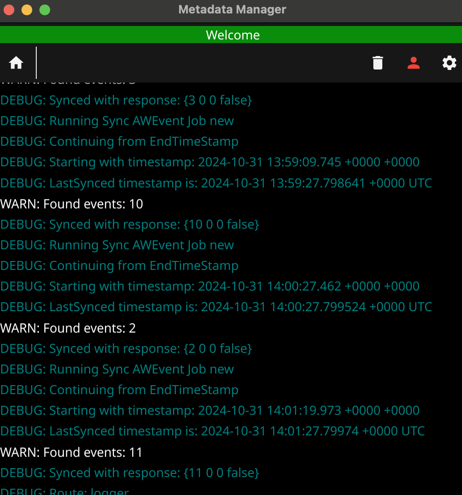

## Introduction

One day, I had a thought, why is it that other organization can track all my stats and not share those raw data with me, even though I am the one who is generating it, obviously few of the services do allow sharing some insights like Netflix watch history or google activities (limited), but it has its own issues like they are not detailed, or some histories are not persistent. 

For me, It all started with my obsession with generating and tracking data, and also in school days when I used to track my day-to-day activities [manually](https://savemytime.co/) whenever I unlocked my phone, but obviously such manual tracking is far too irritating. Now tracking my application usage can be either tracking my day-to-day activities, or all the processes running in my devices or tracking what's running as an active application (application which I am consuming via display) and hence I choose the latter, which is tracking active application and requires minimal intervention from my end.

Recently, I started using software to track my application usage on my laptop to generate raw data which later on I can use for analysis. I started this exercise when I joined HackerRank and started using an open-source software called "Tockler". It's been over 2 years using Tockler, and have been going great

Now it's been a few months, I have been very much into self-hosting and one of the features which I was looking for is, how to view all my device status if they are online or not, and if let's say I had to write a client-side service for it, how will it work, and how the logic works like? And that is when I had a thought, What if I have to show my daily activity on my website, which let people know whether I am online or not, and if yes, then what exactly I am doing. This is very much similar to [Discord Activity Status](https://support.discord.com/hc/en-us/articles/7931156448919-Activity-Status-Recent-Activity)


## Challenges with existing tracking software

One thing which I am sure of was, I need a backend which may or may not store the activity and an API to fetch the details of it. For that to happen, there is a need to consume the data which is getting generated by these software packages, is it either interacting with their APIs if they have, or directly access their storage, or make modifications to the software itself to publish it to some external storage.

That is when I started understanding how Tockler works, since I have been using it for 2 years, and started looking if it is possible to publish the activity. One thing which I understood:
There is no programmatical way of fetching data easily
Data is getting stored in sqllite3
Once there have been a feature of pushing data into Firestore, but it's been deprecated
After looking at these facts, I went ahead and decided, what if I can make publish the events every time an activity changes, which is tracking anytime it makes changes to sqlite3, it pushes to some other service. Hence, I add an eventListner to understand this

```
+        AppManager.knexInstance.on('query', (queryData) => {
+            logger.info(`Executing query: ${queryData.sql}, ${queryData.bindings}`);
+        });
```

Even though it worked fine, it has its own disadvantage:
1. I have to write custom parser, which understand these events and updates in my backend service
2. I will have to introduce changes to the forked repository and maintain it
3. If an event fails to sync with upstream service due to either internet issue or any API failures, I need a backup strategy, by maintaining state or having some queueing mechanism

And looking at these facts, it all makes it more complicated, and it makes me realize that I need a better alternative to Tockler which supports the same feature but better flexibility to overcome my requirements.

## New Tracking Software

While looking out for new software which helps to track application data activity, one big constraint I had was "Portability", it should be able to run on Windows, macOS and on android (optional). And after a couple of research, I did found [ActivityWatch](https://activitywatch.net/)

[ActivityWatch design](https://docs.activitywatch.net/en/latest/architecture.html) somewhat looks like microservice architecture, it has clients which run at localhost:3000, a server which has API endpoints written in rust (migrated from python) and a set of watchers which track activity

The way it stores data is easy to consume: https://notes.shashank-sharma.xyz/services/activity-watcher/schema

Since the server runs at client itself, the APIs can be accessed from localhost:300 and if once I looked at rust code, it indicates that the events can be fetched, and it has filters as well.

And one of the things which I was able to conclude was, I need not make any changes to the software itself, and it gives me enough APIs to use it via external service which I can create.

API endpoints for ActivityWatch: https://github.com/ActivityWatch/aw-server/blob/master/aw_server/rest.py

## Creating Backend

During my whole experience, I have been majorly working in Python ecosystem itself, which means, I have worked with Flask, Django/DRF and FastAPI, and recently, I switched to GoLang when I joined HackerRank, given I have been majorly working in that language itself, which I decided to use so that I can learn more. At the same time, I don't want to build things from scratch like auth or dB setup or logging and more, and while looking at a couple of frameworks, I liked [PocketBase](https://pocketbase.io/) given it is open-source, and it has all the requirements built in.

One thing to note, PocketBase originally was not meant to be used as a framework, but still, I decided to extend its features based off documentation and decided to write custom APIs, as per my requirements. As of my next step, I had to understand how data is stored in ActivityWatch, reading its schema in sqlite3 and deciding what I need to store in my backend, which I have mentioned it here: [Link](https://notes.shashank-sharma.xyz/services/activity-watcher/schema)

Once finalized, another crucial decision to handle is, how to send an online event to the service saying whether the device is online or not and what exactly is running. The first simple approach is, have an API endpoint for POST, and send necessary details if required or simply PING it. Another viable approach can be figuring out new protocols and using their features, for example, MQTT was something which I liked but for the backend which I chose, it didn't have features implemented, or may require some changes; hence I decided to go with REST API approach

I decided to create a table which can support both Tockler backfill + ActivityWatch events sent via API, once done, I created custom API endpoints for easy communication, and added necessary logic for handling edge cases, duplicacy and consistency over which records need to be created with necessary fields present. I spent a good amount of time structuring my code for easy maintenance and better readability, and can be seen [here]()

At last, I needed a better way to send events in an authenticated manner, not too strict with security but at least allowing only my events to be pushed without worrying about auth token expiry or refresh token. For that, I created one static dev token, which can be used for each API calls specific to update tracking items and allows you to update the record for that particular user itself.

 


 

## Creating client

Once backend is ready, now I want a client to be able to fetch necessary records from the ActivityWatch APIs and push it to the server, one of the requirements here is, that it should be desktop application, it should be portable enough to run in windows/mac/linux/android and should be able to run in background if closed. This time, I had a bias of using golang for everything and picked Fyne as my application building framework.

I started to play around with it, ran it on every device, and it's been working great. One of the downsides which I felt is that it is not optimized enough for resource usage. Just a Hello world application bundled with 70+ MB artifact for all the applications, ram usage is also slightly high relative to its job, which is nothing but making a POST request every x seconds, but this is something which anyone can live with it.

At last, I spent writing a POC, tried it in each platform, and it worked perfectly, one downside with Android is that it's not guaranteed that it will run as a Background process based off its limitations and how android handles processes, for example Battery optimization feature might detect my app is taking significant amount of battery and may pause these processes. But obviously these can be overcome by changing a few settings, giving high priority to these apps etc, but still, the android implementation is still in experimental phase when it comes to fyne.

Once finalized, I spent a good amount of time, understanding how to work with Fyne, how to structure the code and stuff; hence I decided to create a better layout for handling routes/pages, cron jobs, clients like backend/activitywatch APIs and more. I am missing out a couple of things, which are:

1. Ability to push all events which have been tracked by activitywatch from day 1
2. Maintaining state of what all events have been processed
3. Figuring out all the buckets available in activitywatch and syncing user preferred events only
4. Detecting ongoing application usage and resending them so that it can be updated
5. And rest common stuff like auth check, logging, cron initialization, closing all cron if app is closed etc.

Again, all this code can be found [here](https://github.com/shashank-sharma/metadata/tree/master/internal)

And at last, everything worked great, and I have been using this app for more than 3 months.

 



 

## Final Result

 


 

I did give thought of adding a feature to spoof data which can be seen in my website because showing my accurate application usage may bring unnecessary complications, but at the same time, spoofing data will ultimately lead to cheating my visitors who are coming to my website and seeing the status. Hence, I decided to keep showing my application visibility as it is, and if in future is I face any troubles with it, then I'll simply hide the application name and start showing the online status only.

## Conclusion

Doing all this does give you satisfaction of seeing all your activity in one place, knowing that you peek into the past and see what you did in the past x years. Having data in one place expands a lot more use cases on what you can do moving forward, for example:

1. What are my working time vs personal time
2. How distracted I am between a given timeframe wrt different devices usage
3. Which application I have been using a lot lately, is it zoom for meetings, or slack for async communication
4. And the one which I am actually interested is in LLM understanding or finding any anomaly which is difficult to find just by a SQL query/filters.


{{< time-mountain data="[{\"date\": \"05 Aug\", \"hours\": 0.81, \"position\": 10}, {\"date\": \"06 Aug\", \"hours\": 0.25, \"position\": 16}, {\"date\": \"07 Aug\", \"hours\": 3.85, \"position\": 22}, {\"date\": \"08 Aug\", \"hours\": 4.42, \"position\": 28}, {\"date\": \"09 Aug\", \"hours\": 1.13, \"position\": 34}, {\"date\": \"10 Aug\", \"hours\": 3.89, \"position\": 40}, {\"date\": \"11 Aug\", \"hours\": 4.19, \"position\": 46}, {\"date\": \"12 Aug\", \"hours\": 0.85, \"position\": 52}, {\"date\": \"13 Aug\", \"hours\": 0.05, \"position\": 58}, {\"date\": \"14 Aug\", \"hours\": 3.04, \"position\": 64}, {\"date\": \"15 Aug\", \"hours\": 1.53, \"position\": 70}, {\"date\": \"16 Aug\", \"hours\": 1.41, \"position\": 76}, {\"date\": \"17 Aug\", \"hours\": 3.79, \"position\": 82}, {\"date\": \"18 Aug\", \"hours\": 1.55, \"position\": 88}]" >}}


