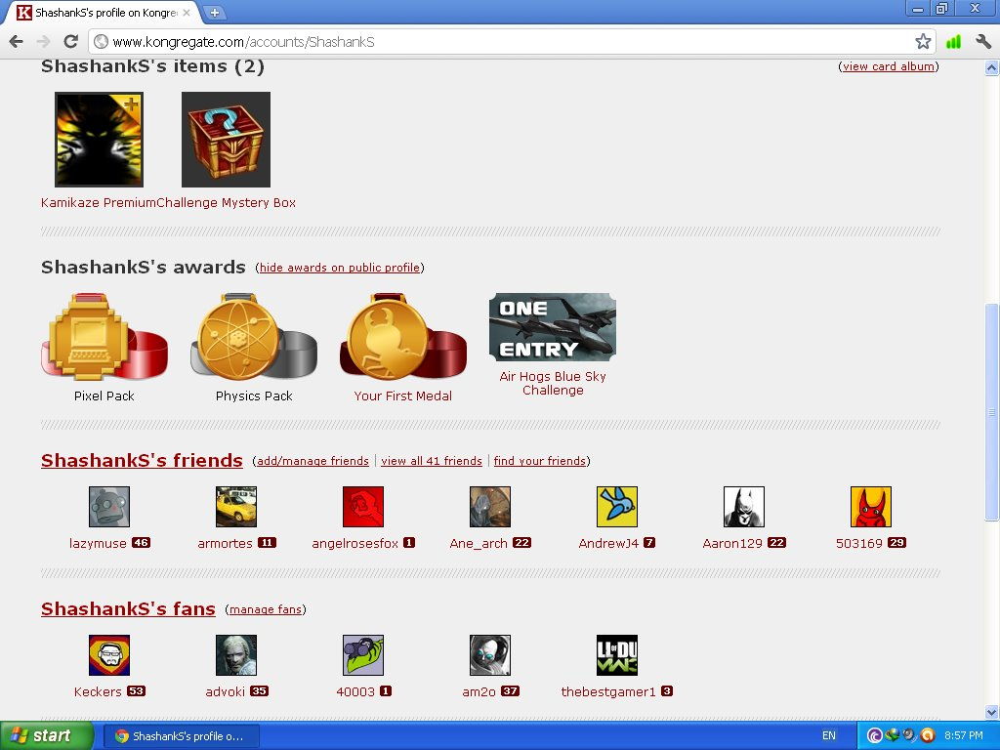
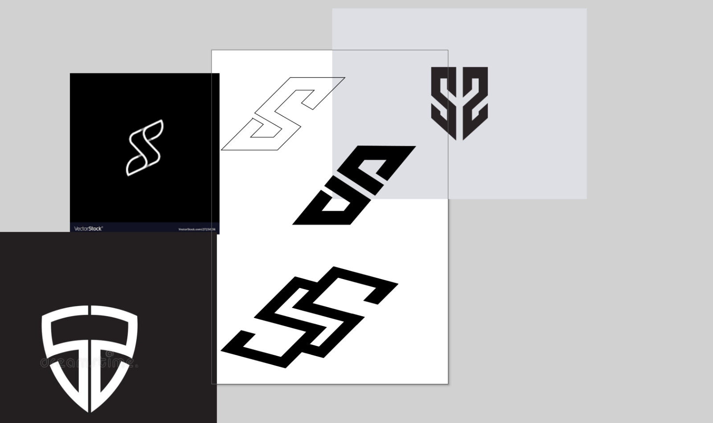

## Introduction

When I was in high school, my first interaction with the internet was all about exploring online games. Kongregate was my go-to website, and I played a lot of games there — if you look at my profile, you'll see activity going all the way back to 2011. Surprisingly I have this screenshot handy, which I took and saved it in google drive.

<aside class="left">
    <h4>Kongregate profile</h2>
    
I used to grind badges and discover new indie games here: <a href="https://www.kongregate.com/accounts/ShashankS/awards">Kongregate awards</a>

</aside>

Around the same time, I discovered the wider world of social media — Orkut, Google+, Facebook, deviantART, and StackExchange. That's when it clicked for me: I needed a place of my own where I could share my thoughts and put my work out there. Back then, I didn't know how to host a static website or manage servers, but I discovered Blogspot/Blogger by Google. You give it content, and it helps you publish online. Simple.

<aside>
    <h4>Why Blogger?</h2>
    
At that time, I didn’t know about hosting, domains, or static site generators. Blogger let me write and hit publish with zero setup — exactly what I needed to get started.

</aside>

## First Version

I created a few random Blogger sites just to experiment. But the first one I truly owned came during Google Code-in 2015, when I put together a blog around Ubuntu GNOME:

[Ubuntu GNOME Experience](https://ubuntu-gnome-experience.blogspot.com/)


<video width=100% controls>
    <source src="imgs/blog-1.mp4" type="video/mp4">
    Your browser does not support the video tag.
</video>


## Second Version

This was my first proper blog where I also wrote a little about myself. During that Google Code-in phase, I learned how to host websites via GitHub Pages, and I built another site where I showcased my work. I played with HTML, CSS, and the MaterializeCSS style pack. That shift was a milestone for me, and I kept it running for a while.

<aside class="left">
    <h4>MaterializeCSS</h2>
    
Back then, MaterializeCSS gave me clean components out of the box — cards, navbars, grids — and made the site feel modern without me reinventing the wheel.

</aside>


<video width=100% controls>
    <source src="imgs/blog-2.mp4" type="video/mp4">
    Your browser does not support the video tag.
</video>


## Third Version

Then college happened. Early on, I focused more on DS/Algo — solving CodeChef/HackerEarth problems — and didn't spend much time on blogging. But when I started working on a small project, I wanted to apply those data structures to something real. That's when I stumbled upon India's MP Transportation public data and realized I could use it. I built a project around it and wanted to share it with the world. At that time, I still didn't knew much about CMS frameworks, so I went back to Blogger — it was the easiest way to publish.


<video width=100% controls>
    <source src="imgs/blog-3.mp4" type="video/mp4">
    Your browser does not support the video tag.
</video>


## Fourth Version

By 2018, I had learned more about frontend and backend, and I wanted something compatible with GitHub Pages. I picked Jekyll, migrated my content from Blogger, and added proper sections. It finally felt original — something more like my own home on the web.


<video width=100% controls>
    <source src="imgs/blog-4.mp4" type="video/mp4">
    Your browser does not support the video tag.
</video>


## Fifth Version
Later, I wanted the site to feel more personal and unique compared to the usual portfolios/blogs. I saw a few really distinct sites and kept wondering how they pulled off those unique experiences. I took it personally and put in the effort. Around the same time, I was exploring digital art, so I decided to bring that into the website too. That's when I built a site with a floating island, some transitions, timelines — and I went a bit wild with it.


<video width=100% controls>
    <source src="imgs/blog-5.mp4" type="video/mp4">
    Your browser does not support the video tag.
</video>


I ran that floating-island site for the longest time. But around 2025, I felt I could do better. The floating island looked good, but something was missing — it wasn't truly 3D, and it didn't feel meaningful. That's when it hit me: what if I showcased my Minecraft builds instead? Builds I made from scratch, one block at a time. Real work and real stories behind them.

So I learned how to export Minecraft worlds into a readable format, fed them into Blender, converted them into 3D objects, added transitions, and exported them into MP4 files. Then I optimized those with HandBrake so they load fast. And that’s where we are now — with the new website.

<aside class="left">
    <h4>Explore more</h2>
    
On the new site, click the <em><a href="/worlds">Explore more</a></em> button at the bottom left to dive into what happened behind the scenes and relive those moments.

</aside>

## Bonus

If it is not obvious, but I created the logo myself using Inkscape. Did couple of iteration, but finally found one perfect logo :)

