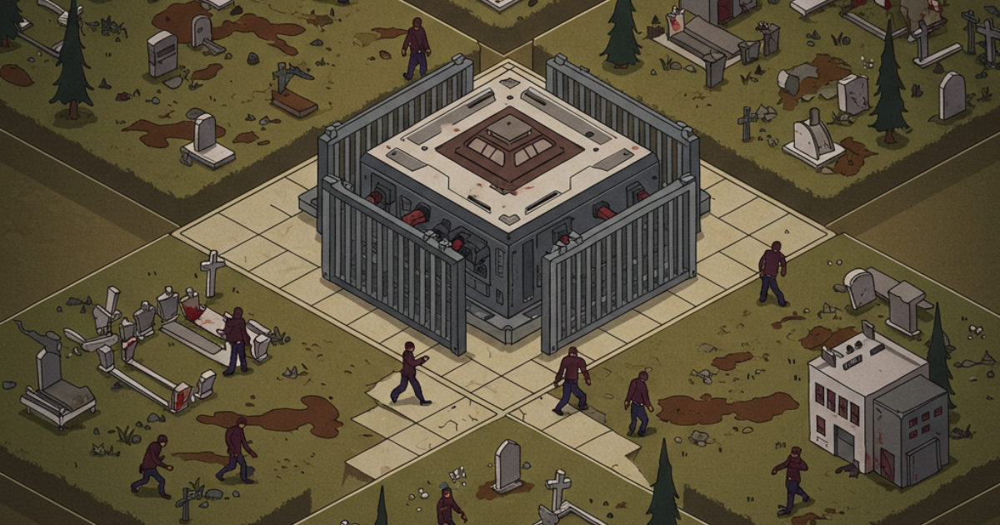
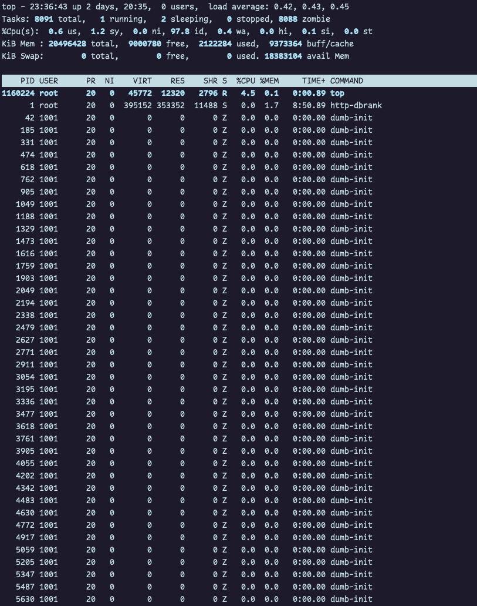
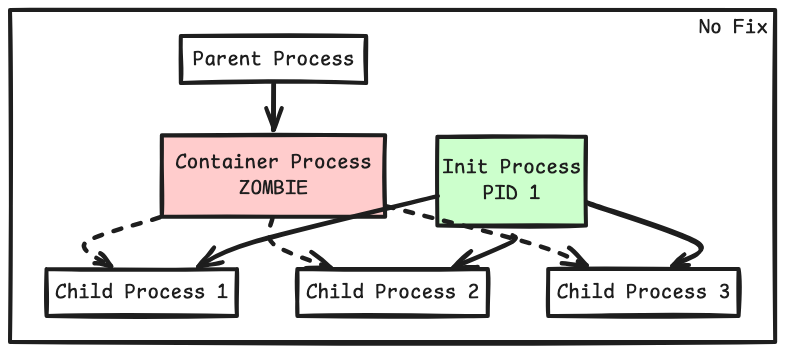
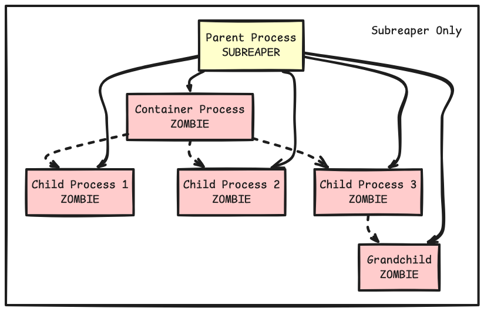
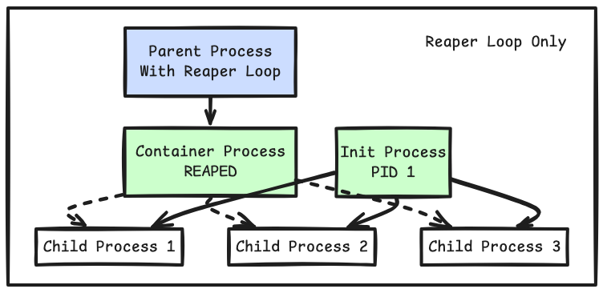
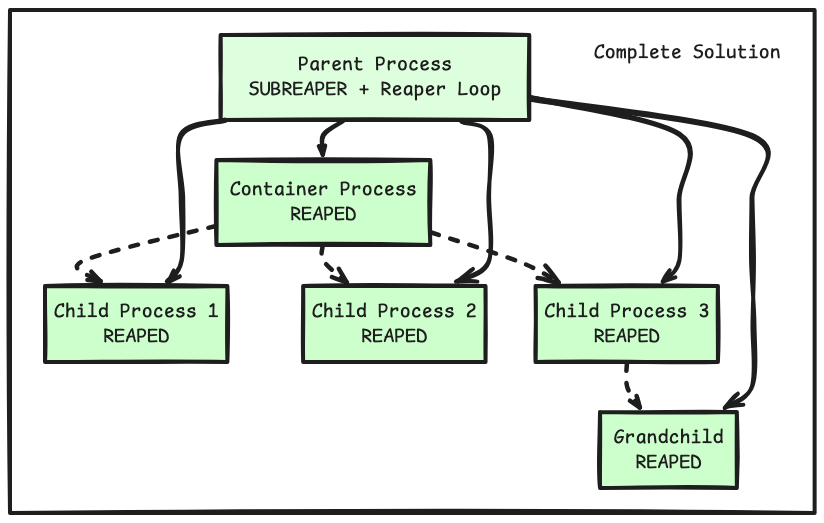

## Introduction

You might have seen problem statements where the user is expected to execute SQL queries based off problem statements and check whether the query output is correct or not. During my work at HackerRank, one of the use case which I was assigned was to figure out, why database query execution takes more time and how we can further improve it.

Now obviously, whenever user input execution comes into picture, it's better to take precaution and containers are usually the best tools for this job and this brings many complications. This blog details my journey through diagnosing, replicating, and solving this problem.

## The Mystery Begins: Increasing Memory Usage

Initially, my task was nowhere near this, I was planning to improve the overall execution with caching and better checkpointing of the container, but turns out, in general, execution time had two parts for it:
1. Time it took to execute the query in the container
2. Time it took to execute the query while container is being brought up

Now, the second problem statement is out of the scope of this blog; hence, we'll assume that the containers are readily available. It all started with an investigation, understanding what was happening with existing containers, and I noticed a concerning pattern in our monitoring dashboard. Some of our pods were showing steadily increasing memory usage over time

Obviously, it won't increase without any reason, and the pattern was clear: memory usage would gradually climb higher with increased query frequency. This was particularly concerning because our service is designed to handle sustained high loads, and memory leaks could eventually lead to service degradation or outages.

## The Smoking Gun: 8088 Zombies

While investigating a production container, I ran a standard top command and was shocked by what I saw:

<aside class="left">
    <h4>What Are Zombie Processes Anyway?</h2>
    <p>A zombie process is a terminated process that has completed execution but still has an entry in the process table because its parent hasn't read its exit status. While zombies release their user-space memory (which is why they show 0 memory usage in ps), they still consume system resources in other ways.</p>
</aside>



8088 zombie processes! This was definitely not normal, and immediately rang alarm bells. And after confirming with other containers, we saw the correlation that the longer the container is running and active, more zombies were created, which means these zombies were created per request being processed.

## Connecting to Container Runtime

<aside>
    <h4>What is runc?</h4>
    <p>runc is a lightweight, portable container runtime that implements the Open Container Initiative (OCI) specification. It's the low-level tool that actually creates and runs containers - the same technology powering Docker, Kubernetes, and most modern container platforms.</p>
</aside>

Obviously, my initial instinct was to make it reproducible locally so that it can be resolved quickly, and once I did local setup with test data, I needed to figure out who is exactly creating these zombie processes and turns out, it was `runc` itself, and how we were maintaining container lifecycle.

Now searching google didn't have much info around it but after a few nights, and digging through multiple documentations, I found this in terminals.md[^1]:

> Using detached mode is a bit more complicated and requires more care than the foreground mode -- mainly because it is now up to the caller to handle the stdio of the container. Another complication is that the parent process is responsible for acting as the subreaper for the container. In short, you need to call prctl(PR_SET_CHILD_SUBREAPER, 1, ...) in the parent process and correctly handle the implications of being a subreaper. Failing to do so may result in zombie processes being accumulated on your host.

This was precisely our situation!

## What's Really Happening? The Full Picture

When a container is launched in detached mode, the container runtime creates processes and then exits. These processes may spawn additional child processes, creating a hierarchy. When processes within this hierarchy terminate, their children become "orphaned."

In standard Linux behaviour, orphaned processes are "reparented" to the init process (PID 1), which periodically reaps zombie processes. However, in containerized environments, this reparenting behaviour can be disrupted, leading to zombie accumulation.

Each zombie process:

<aside class="left">
  <h4>The Process Table</h4>
  <p>Each entry in process table consumes kernel memory and contains metadata like process state, credentials, and resource usage. The table has a finite size (typically 32,768-65,536 entries), making it a critical resource that zombie processes can exhaust.</p>
</aside>

1. Occupies a process table entry - This is the most critical constraint as systems have a maximum number of processes (typically 32,768-65,536)
2. Consumes kernel memory - Not visible in user-space tools like ps or top
3. Retains parent process resources - The parent must maintain references for each zombie child
4. May hold on to file descriptors - If not properly closed before termination

## The Solution: Implementing a Subreaper

The fix was actually basic. I implemented a subreaper in our container management code:

```
if err := unix.Prctl(unix.PR_SET_CHILD_SUBREAPER, 1, 0, 0, 0); err != nil {
    return fmt.Errorf("error setting subreaper: %+v", err)
}
```

And something like this (either have a gorouting, or reap it during container termination):

```
go func() {
    for {
        var wstatus unix.WaitStatus
        pid, err := unix.Wait4(-1, &wstatus, unix.WNOHANG, nil)
        if err != nil && err != unix.ECHILD {
            log.WithError(err).Warn("Error in reaper goroutine")
        }
        if pid > 0 {
            log.Debugf("Reaped zombie process with PID %d", pid)
        }
        time.Sleep(100 * time.Millisecond)
    }
}()
```


This two-part solution ensures:

1. **Process Capturing**: The `PR_SET_CHILD_SUBREAPER` flag ensures all orphaned processes in the container hierarchy are reparented to your process instead of init.

2. **Active Reaping**: The reaper goroutine actively collects the exit status of terminated child processes using non-blocking `Wait4()` calls.

## Understanding the code snippet

To fully understand these results, we need to explore the Linux subreaper mechanism in depth.

The `PR_SET_CHILD_SUBREAPER` flag was introduced in Linux kernel 3.4 to address limitations in process management for container-like environments. The reference can be seen in arch linux man page as well.[^2]

This mechanism was specifically designed for container orchestration to ensure proper cleanup of containerized processes. However, as our experiment showed, setting the flag is only half the solution. The process must still actively reap its adopted children using `wait()` or similar calls.

Let's look at a couple of scenario based off what we discussed, assuming we are creating 20 containers and destorying it:

### 1. No Fix Scenario (20 zombies)

Without any zombie prevention, only the direct child processes (the container processes launched by our test program) become zombies. Any processes spawned within the containers get reparented to the system's init process, which may or may not automatically reaps them based off how complex the logic might be.



### 2. Subreaper Only Scenario (118 zombies)

When setting the subreaper flag without implementing a reaper loop, the parent process becomes responsible for all orphaned processes in the container hierarchy, but never reaps them:



The increased zombie count demonstrates that containers create complex process hierarchies that would normally be reaped by init, but are now "captured" by the subreaper without being cleaned up.

### 3. Reaper Loop Only (4 zombies)

Using only a reaper loop without the subreaper flag works reasonably well for simple process hierarchies but misses some processes in complex scenarios:



The reaper loop can only reap direct children, but init still handles the orphaned processes.

### 4. Complete Solution (0 zombies)

Using both mechanisms together provides complete zombie prevention:



All processes in the hierarchy become the responsibility of the parent process, which actively reaps them.

## Minimal Reproducible code
To validate that zombie processes were causing our memory issues, I designed a controlled experiment. I created a test application that:

1. Created containers in detached mode similar to our production environment
2. Optionally enabled the subreaper fix
3. Tracked memory usage and zombie count over time

Code can be found here:

<div class="dark-invert">

</div>

And as per result:

| TIME (MIN)   | ZOMBIES   | MEMORY (MB) | CONTAINER | % CHANGE (MEMORY) |
|---------|--------|-------------|---------|-------------------|
| 0:0     | 10     | 1992        | 10      | -                 |
| 60:00   | 4000   | 2100        | 10      | +5.42%            |
| 330:24  | 19851  | 2236        | 10      | +6.48%            |

And the worst part is, as soon as I hit the upper limit of zombie processes, After about 5.5 hours, the system hit a critical resource limit and could no longer create new processes with an error:

`Failed to create container zombie-test-20251-0: fork/exec /usr/bin/sudo: resource temporarily unavailable`

## Production Impact

After implementing both components in the service, we observed immediate improvements:

1. Zombie processes no longer accumulated
2. Memory usage stabilized
3. System stability improved dramatically

The before/after comparison shows clear improvement:

| Observation | KiB Mem Total | KiB Mem Free | KiB Mem Used | KiB Mem Buff/Cache |
|-------------|---------------|--------------|--------------|-------------------|
| Before change (1) | 2032964 | 641188 | 249340 | 1142436 |
| Before change (2) | 2032964 | 625512 | 277956  ↑ | 1129496 |
| Before change (3) | 2032964 | 626244 | 303504 ↑ | 1103216 |
| Before change (4) | 2032964 | 618552 | 329220 ↑ | 1085192 |
| After change (1) | 2032964 | 612948 | 291732 | 1128284 |
| After change (2) | 2032964 | 616888 | 293164 | 1122912 |
| After change (3) | 2032964 | 623816 | 294056 | 1115092 |
| After change (4) | 2032964 | 619660 | 295016 | 1118288 |

Here you can see memory usage has been increased (↑) before change, but after change, it's being consistent, and I was able to confirm via memory usage in dashboard as well.

## Real-life Example: Comparison with Other Container Runtimes

This issue is not unique to `runc`. Other container runtimes have addressed the zombie process challenge in somewhat similar ways:

- **containerd**: Utilizes a shim process that acts as a subreaper. By setting the PR_SET_CHILD_SUBREAPER flag, the shim ensures that orphaned processes are reparented to it and subsequently reaped.[^3][^4]
- **podman**: Uses conmon as a monitoring process to handle container lifecycles and reap zombie processes. conmon runs as a separate process and ensures that all child processes are properly managed.[^5]
- **CRI-O**: CRI-O's integration with Kubernetes allows it to manage container processes effectively, reaping zombies as part of its runtime responsibilities. ​[^6]

The consistency across implementations confirms that this two-part solution is the industry standard approach.

## Conclusion

This journey taught me that system resource management goes far beyond what's visible in standard monitoring tools. Zombie processes represent a fascinating edge case where processes that seem completely inactive (0 CPU, 0 memory) can still bring down a production system.

By implementing proper process management with the subreaper pattern, we eliminated our memory leak issues and significantly improved the stability of our DBRank service. This experience does serve as a reminder that understanding operating system fundamentals is crucial for building production-grade systems.

This understanding aligns perfectly with the guidance in the `runc` documentation, but provides more in-depth insight into *why* both components are necessary.

## Bonus

This whole experiment, I was able to test it out thanks to my 8-year-old laptop with Ubuntu OS. Reason being, `runc` is not supported for mac, and using linux VM to test out `runc` containers or worst, checkpointing/restore via `criu` is a nightmare, hence, my laptop was helpful


[^1]: runc documentation: https://github.com/opencontainers/runc/blob/master/docs/terminals.md

[^2]: ArchLinux reference: https://man.archlinux.org/man/pid_namespaces.7.en?utm_source=chatgpt.com#Adoption_of_orphaned_children

[^3]: containerd subreaper code: https://github.com/containerd/containerd/blob/release/2.0/pkg/shim/shim.go#L244

[^4]: containerd reap code: https://github.com/containerd/containerd/blob/release/2.0/pkg/sys/reaper/reaper_unix.go#L264

[^5]: podman conmon: https://github.com/containers/conmon/blob/v2.1.13/src/utils.c#L88

[^6]: CRI-O implementation: https://github.com/cri-o/cri-o/pull/272/files

{{< time-mountain data="[{\"date\": \"23 Mar\", \"hours\": 0.32, \"position\": 10}, {\"date\": \"24 Mar\", \"hours\": 0.05, \"position\": 16}, {\"date\": \"27 Mar\", \"hours\": 0.01, \"position\": 28}, {\"date\": \"28 Mar\", \"hours\": 0.01, \"position\": 34}, {\"date\": \"29 Mar\", \"hours\": 1.14, \"position\": 40}, {\"date\": \"30 Mar\", \"hours\": 3.13, \"position\": 46}, {\"date\": \"31 Mar\", \"hours\": 2.76, \"position\": 52}, {\"date\": \"01 Apr\", \"hours\": 1.7, \"position\": 58}, {\"date\": \"02 Apr\", \"hours\": 1.77, \"position\": 64}, {\"date\": \"03 Apr\", \"hours\": 1.0, \"position\": 70}]" >}}