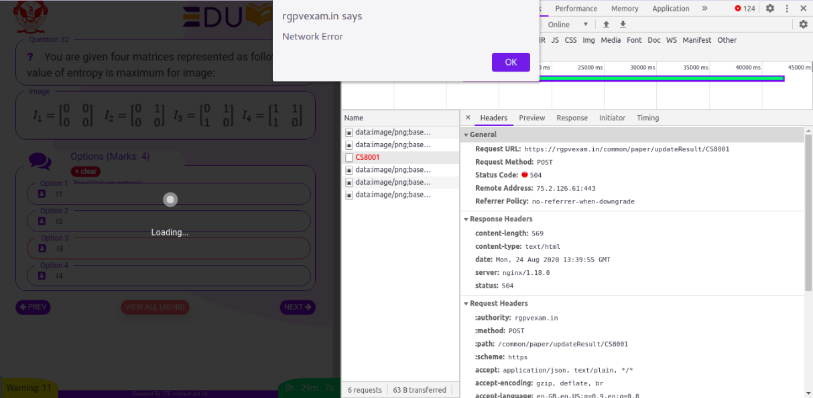
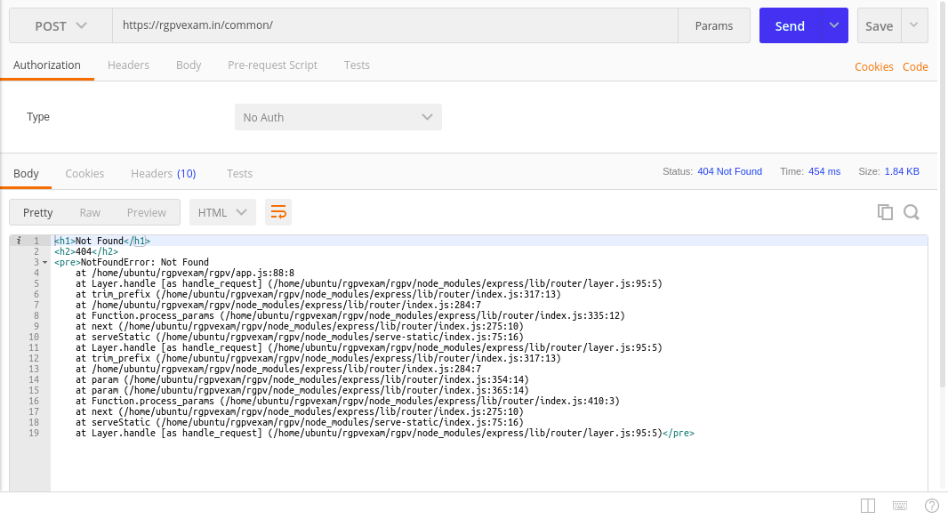
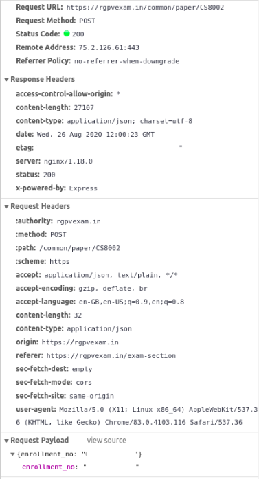
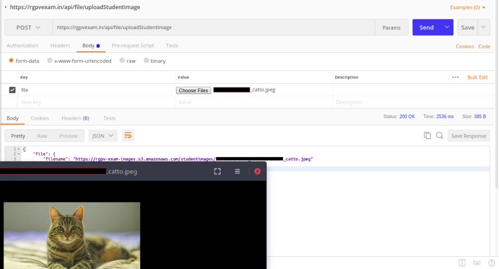
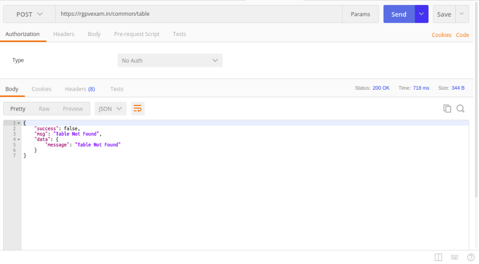
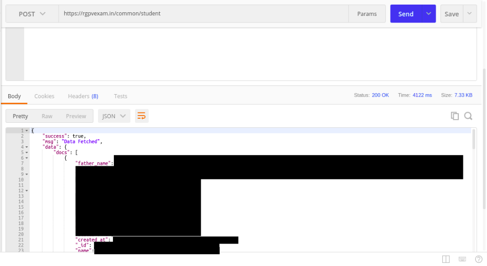
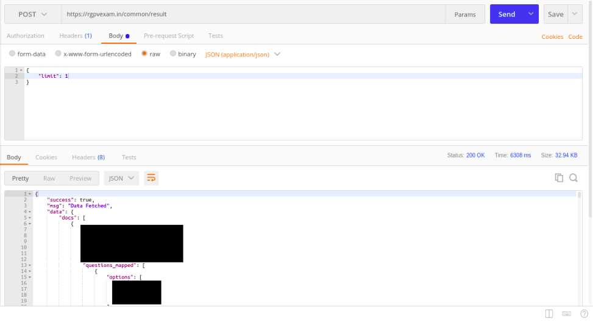
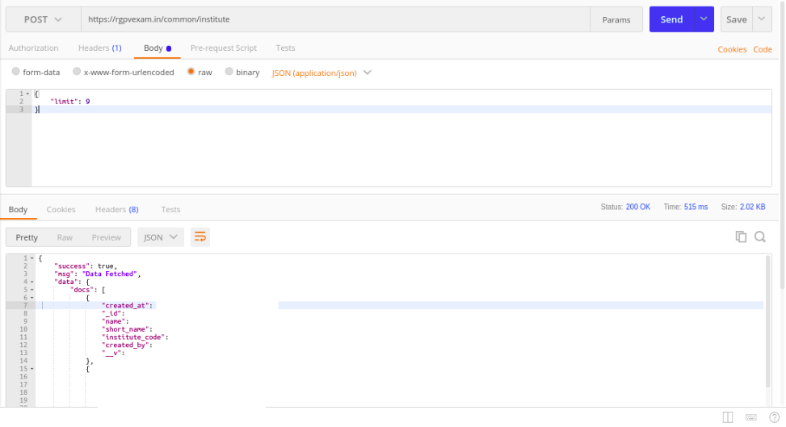
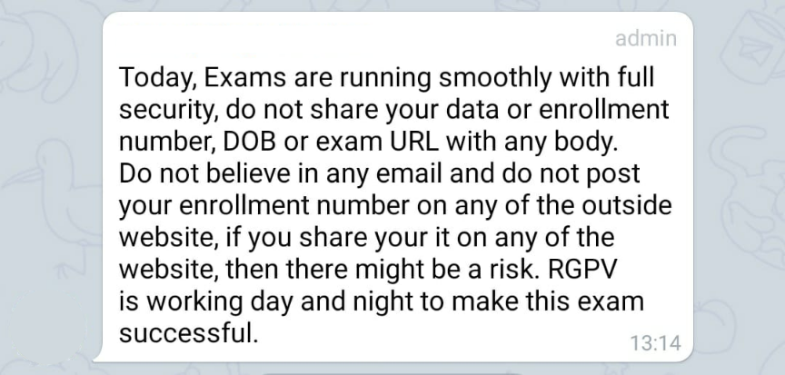

## Preface

The main reason behind this blog is to understand the seriousness of mistakes that were made without any proper arrangements 
and the impact of such mistakes. In this blog, I'll be covering how the RGPV Exam portal was so vulnerable that it 
exposed around 49 thousands of students' private data/submissions publicly and how it could have ruined everyone's 
exam without any authentication.

Impact of given vulnerabilities include:

1. 49,000 students of RGPV student data leak which includes all possible PII data (like: phone number, email, etc)
2. Question paper leak
3. Submit exam for any other student
4. Unlimited image upload to their server
5. LFI Exploit which allows you to see file content from their server
6. View all student submission like question answered from final exams which held during 24th Aug - 27th Aug 2020


## Introduction

After Covid-19 pandemic started, [RGPV University](https://en.wikipedia.org/wiki/Rajiv_Gandhi_Proudyogiki_Vishwavidyalaya) announced that for final year students, they are planning to organize an [exam](https://www.rgpv.ac.in/CDN/PubContent/Advertisement/Letter230720070203.pdf) which will consist of MCQ questions (total 40 questions) and it will be an open book exam as mentioned [here](https://www.rgpv.ac.in/CDN/PubContent/Advertisement/general%20instructions%2019%20Aug%202020190820064558.pdf). This process started by taking two mock exams
to test if things are good or not, and then having the final paper from the 24th of August till the 1st of September 2020.

Now with given information, RGPV decided to create one exam portal for us, which was handled by [Eduvita](http://www.eduvita.in/#/home). They started registration and creation of portal at [rgpvexam.in](https://rgpvexam.in). How the overall exam process was figured out is by having one unique URL for every student assigned, which allows for that particular student to give an exam.

## Step towards testing exam portal

During the first day of the exam, there were many issues where it was returning: Network Error. The full story can be found [here](https://timesofindia.indiatimes.com/city/bhopal/tech-glitches-wrong-timing-mar-first-day-of-rgpvs-open-book-online-exams/articleshow/77730600.cms) which shows that there were technical difficulties and I also faced this issue.

Now being a Computer Science Engineer, I was already curious about this scenario, and As of my first step, I started with the Debugger 
tool and investigated what was happening. At first, I encountered one debugger state which they initialized in their `index.html` 
file, which avoids people to debugging their javascript code. If you are curious, read this [here](https://stackoverflow.com/a/39784526/3523510).

<aside>
    <h4>Sidebar</h2>
    <p>This is some content in the sidebar.</p>
</aside>

On bypassing this, I observed my Network tab and found that there was a 504 error returned, as shown in the image.




<aside class="left">
    <h4>Sidebar</h2>
    <p>This is some content in the sidebar.</p>
</aside>

Now as of the next step, I was more interested in knowing if their website is vulnerable or not? 
This curiosity leads me to use the Nmap tool, I started one vulnerability check script, and after 5 min, there were two exploits which I found:


1. http-phpmyadmin-dir-traversal: PHP file inclusion vulnerability which allows remote attackers to include local files via the redirect parameter, possibly involving the subform array.
2. http-vuln-cve2011-3192: Vulnerable to a denial of service attack when numerous overlapping byte ranges are requested.


The second vulnerability was more towards DDOS attack, But the first vulnerability was shocking, as it was an LFI exploit (Local File Inclusion). 
To confirm the hypothesis, I tested it by traversing random directory, and after 8 - 10 attempts, 
I was able to test it by:

`<base_url>/index.php/?p=../../../<any_file_name>`

Impact: Allows anyone to access Local files directory, which includes any file like environment keys, logs, or any sensitive data.

## Understanding Tech Stack

Before moving ahead, I started by exploring their tech-stack, and with a little bit of exploration, I found out that they are using:

1. Frontend - Angular JS
2. Backend - Express
3. Web server - Nginx
4. Database - MongoDB

With given knowledge, I went ahead observing their API structure and started messing around with it. At first, I send one random POST request, and on the response I got:



This was my first red flag that things are not right because, in production, it's not a good practice to show error stack. Later on, the webserver went down so I had to call it a day.

The next day, I repeated the vulnerability test, and I found that LFI exploit is no longer present, which is an improvement. (LFI was there till 24th of August 2020).

On my coming paper 26th August 2020, I was prepared for further testing, 
I started capturing all the networks request happening and noted down all the endpoints and their content. 
So for a typical exam in RGPV Exam portal, things were like:

1. Check OTP: `<base_url>/common/student/urlcheck`
2. Check DoB/Fathers Name: `<base_url>/common/student/checkdob`
3. Upload photograph: `<base_url>/common/student/checkexamconfig`
4. Confirm Profile: `<base_url>/common/student/confirmprofile`
5. Waiting Phase: `<base_url>/common/student/checkexamconfig`
6. Exam Started: `<base_url>/common/paper/<exam_code>`
7. Exam Submission: `<base_url>/common/paper/<exam_code>`

<b>Problem with all these steps is that except step 1 and 3, each POST request to an endpoint needs only `enrollment_no` as their body to get 
a response which is worrying because ideally there has to be JWT token used in a header which acts as an authentication.</b>

#### <strong>Impact</strong>

Given you have any person `enrollment_no` which exist in their database, anyone can:

##### <b>1. Question Paper Leak</b>



Get full question paper in JSON format as a response. It includes all question list and answer list.

##### <b>2. Create/Update/Delete Exam Submission</b>

As explained above, with the enrollment number, anyone can overwrite the submission of another student easily without any authentication.

##### <b>3. Upload Image without Auth</b>

As of the third step, which is uploading your photo through webcam. From the client-side, it captures an image and requests to backend endpoint with only file content without any authentication. So, in reality, anyone can upload any image to the given endpoint and spam given AWS S3 server with their cat photos.




##### <b>4. Minor Data Leak</b>
As of the fourth step, it is just a confirmation page which takes enrollment_no and responds with:

1. Name
2. IP address
3. Institute name


## Reverse Engineering

### Frontend

Understanding compiled Angular JS code is quite painful, but I was pretty much interested in all the endpoints registered in the code. 
As of the first step, I saved rgpvexam.in page and checked out their JS code by making it prettify and finding 
"http.post" in code. Once I understood their code I found all possible endpoint registered over there:

```javascript
checkUrl(t, e = {}, n = 1, i = 10) {
    return this.http.post(`${this.baseUrl}/${t}/urlcheck`, {
        query: e
    })
}
checkDob(t, e = {}, n = 1, i = 10) {
    return this.http.post(`${this.baseUrl}/${t}/checkdob`, {
        query: e
    })
}
checkExamConfig(t, e = {}, n = 1, i = 10) {
    return this.http.post(`${this.baseUrl}/${t}/checkexamconfig`, {
        query: e
    })
}
confirmProfile(t, e = {}, n = 1, i = 10) {
    return this.http.post(`${this.baseUrl}/${t}/confirmprofile`, {
        query: e
    })
}
getresult(t, e = {}, n = 1, i = 10) {
    return this.http.post(`${this.baseUrl}/${t}/getresult`, {
        query: e
    })
}
getQuestions(t, e) {
    return this.http.post(`${this.baseUrl}/paper/${t}`, e)
}
updateResult(t, e) {
    return this.http.post(`${this.baseUrl}/paper/updateResult/${t}`, {
        query: e
    })
}
updateSeen(t, e) {
    return this.http.post(`${this.baseUrl}/paper/updateSeen/${t}`, {
        query: e
    })
}
updateAnswered(t, e) {
    return this.http.post(`${this.baseUrl}/paper/updateAnswered/${t}`, {
        query: e
    })
}
getData(t, e = {}, n = 1, i = 10) {
    return this.http.post(`${this.baseUrl}/${t}/urlcheck`, {
        query: e
    })
}
searchData(t, e = {}, n = 1, i = 10) {
    return this.http.post(`${this.baseUrl}/${t}/urlcheck`, {
        query: e
    })
}
createData(t, e) {
    return this.http.post(`${this.baseUrl}/${t}/urlcheck`, {
        doc: e
    })
}
updateData(t, e, n) {
    return this.http.post(`${this.baseUrl}/${t}/urlcheck`, {
        doc: n
    })
}
deleteData(t, e) {
    return this.http.post(`${this.baseUrl}/${t}/urlcheck`, {
        id: e
    })
}
mailLink(t) {
    return this.http.post(`${this.baseUrl}/${t}/urlcheck`, {
        enrollment_no: t
    })
}
mailOtp(t) {
    return this.http.post(`${this.baseUrl}/${t}/urlcheck`, {
        enrollment_no: t
    })
}
checkOtp(t, e) {
    return this.http.post(`${this.baseUrl}/${t}/urlcheck`, {
        enrollment_no: t
    })
}
uploadFile(t) {
    const e = new FormData;
    return e.append("file", t, t.name), this.http.post(Dc.url + "/api/file/uploadStudentImage", e, {
        reportProgress: !0,
        observe: "events"
    })
}
uploadFace(t, e) {
    const n = new FormData;
    return n.append("file", e, e.name), this.http.post(Dc.url + "/api/file/uploadFace/" + t, n, {
        reportProgress: !0,
        observe: "events"
    })
}
```

This confirms that all endpoints were using `enrollment_no` as their identifier without any authentication.

### Backend

Once I knew about all the endpoints, it was time to test other endpoints as well which were not mentioned in the frontend code. 
This is where I started experimenting with random endpoints because there has to be something out there.

One thing which is repetitive in each endpoint was:

`<base_url>/common/<something>`

Where something is either student or paper, but for testing, I tried some random string like "table" and the response was a bit shocking as shown in the image.




Here, "Table Not Found" means that anything after `/common/` will count as table name and it will return all data present for that table.  
I started with multiple strings like "exam", "user" or anything sensitive and then I found multiple table name which was present.

To show how serious is this, anyone with bad intention might have written a script with common table names and might have spammed a given endpoint to extract every single data from a given table.

#### <b>Impact:</b>

Given vulnerability existed till 28th of August 2020 which includes mock tests and two final exams for all possible branch

##### <b>1. /common/student</b>
Reveals 49 thousand student information present in the database who registered for the RGPV Exam portal and this includes every PII which RGPV has (like dob, IP, phone_no, email, etc) including unique id, 
OTP which was meant to be safely stored by each student and much more.




In general, the privacy of every student was compromised and no one knows 
how many of them extracted all the given data and might have sold this or using it for marketing purposes.

##### <b>2. /common/result</b>
Reveals every student submission, this submission includes all answers given 
for the given question and at which time, which question was seen, and more.




In short, anyone will know which student gave which exam with how much correctness and how much time was taken.

##### <b>3. /common/institute</b>
All institute with their ID and name present in DB. 
This was not much helpful in revealing sensitive data but not good to share.




## Conclusion

This whole process of organizing the final exam is rushed heavily because of which I found multiple vulnerabilities.
I found LFI and Data Breach in every possible way, 
our privacy of around 49 thousand students' data was compromised by the exam portal.
Problem is that the given mistake is not reversible, the damage is already done but thanks to RGPV that they realized 
this later on and fixed this problem.

## What I did from my end?

As soon as I found out about these exploits, I approached almost all possible contacts:


1. RGPV - No reply from "rgpvexam2020@rgtu.net"
2. NCIIPC - Got reply + Sent report
3. AICTE - No reply

For minor questions, I approached via Telegram but no response over there as well.

## What's Next?

As of 28th of August 2020, we were notified in Telegram channel that:




In short, some Security updates were made but what exactly was it is still unknown in the given message 
but I believe they should have at least mentioned as if what sort of mess they created to start with. 
But there are still a few things which need improvement.

From my end, once I saw the message, I quickly saw all API endpoints again, and finally, those exploits are gone. 
Now getting student's data or any table data is not possible so that is fixed. The whole process of examination
is introduced with the JWT token. So once the user enters with a unique URL and confirms dob and father's name, then one JWT token is returned 
and used in the future endpoint. So this is great news for everyone.

But now the real question remains, is this the solution? Technically yes, but what about the damage which already happened, still data is already leaked, 
because OTP of each user is already leaked so we all are still exposed.

Having no authentication mechanism to start with and introducing it, later on, is an improvement, but why are we compromising this in such a larger audience platform? and
who will be responsible for this? Now this is something which is still unknown