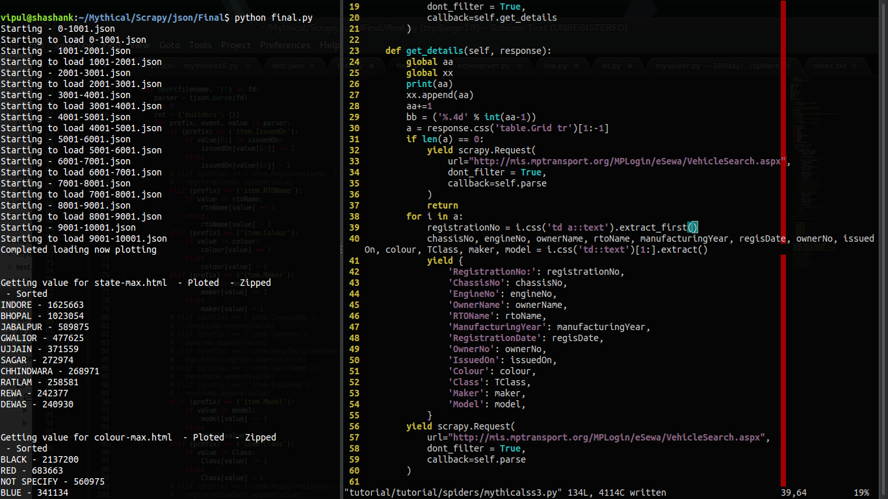

## Introduction

Python is really a powerful language and with proper use of it anyone can make beautiful things. After studying Python I was really impressed by its power and to be more specific I really love how we can scrape any website easily with the help of python. Scraping is a process of extracting data from website by their html data. So I learned its basic and started scraping many website.

Recently I thought of creating something big through scraping but I was having no idea what to do. Then I came across with the site of MP transportation and I realized that they got so many data inside there website. The website is very simple, you open the site enter your transport number details and then search it. Then you will get result about your transport vehicle which includes type, color etc.

With python2.7 I created one script to scrape because with python 3.x there were less support to some modules. I decided to go for 'last' search type because with others I was facing some issues (may be site problem). For this I will have to search each input from 0000 - 9999 in short it makes around 10000 requests. We took 4 digits because it requires min 4 characters to enter. So yeah it was this large.

I created one program and started scrapping but then with 0000 input and 'last' type search I found that it scraped successfully and I got 1700+ data. But the problem was that it took 5 minutes to scrape 1 request. This happened because of server delay. It was not my problem but it was server's problem to search this much data from database. After realizing this I did some maths.

If 1 request take = 5 minutes,
then,
10000 requests = 50000 minutes = 833.33 hours = 35 days approx = 1 month 4 days

So in short I need my laptop to run for&nbsp;<b>1 month and 4 days</b>&nbsp;to run continuously and trust me it's really a bad idea to do so. But is it worth doing it ?

If 1 request is giving approx 1000 data
10000 requests = 10,000,000

So yeah, hypothetically in&nbsp;<b>35 days I will be able to achieve 10 millions of data.</b>
But still being a programmer we must do stuff as fast as possible and to achieve this one thing is sure that I need some power, memory, security etc. I tried Multiprocessing and multi threading but it was not working as expected

So the solution for this problem was getting your hand on some free servers. So I started searching some free website host company which supports python and thought of deploying my script over there. I tried this in pythonanywhere.com and in Heroku with the help of Flask framework but there was no success. I waited almost 15 days to decide what to do. Later I found one site scrapinghub.com which lets you deploy spider on cloud and rest they will take care of that so I went for it and started learning it.

After that I learned how to use Scrapy and scrapinghub and I created another new program to scrape website with the help of Scrapy spiders. Source code for this is at the end of this page 

## Experiment

<b>Day 1 - 4,092,328 (4 millions of data in 17 hours)</b>
 
Id1 - Items - 1,134,421 (15 hours) 
Id2 - Items - 1,025,282 (17 hours) 
Id3 - Items - 983,367 &nbsp; &nbsp;(14 hours) 
Id4 - Items - 949,228 &nbsp; &nbsp;(13 hours) 

Size - 1.3 GB
 
<b>Day 2 - 6,498,462 (6.4 millions of data in 17 hours)</b> 
(Created 2 more id's to boost my process) 
 
Id1 - Items - 1,241,643 (17 hours) 
Id2 - Items - 1000308 &nbsp; (15 hours) 
Id3 - Items - 962863 &nbsp; &nbsp; (15 hours) 
Id4 - Items - 1052844 &nbsp; (15 hours) 
Id5 - Items - 1144686 &nbsp; (16 hours) 
Id6 - Items - 1096118 &nbsp; (15 hours) 
 
Size - 2.4 GB 
 

## Final Result

<blockquote class="tr_bq">
<b>Total data collected: 10,590,790</b></blockquote>

<b>Total size: 3.7 GB</b> 
<b>Time consumed: 34 hours</b>

In just 34 hours by scraping we collected 10 millions of data which was estimated earlier. If we tried to do this process in old fashion like in laptop then it would have taken 1 month so we optimized it.

## Data Analysis

The main question arises is what to do with data ? Which tools to use while analyzing.
Since the size of our JSON files are huge. If we will be able to convert JSON file to database file then it would be really great but doing this will again require loads of time.

From JSON to Database 
We can do 5 data per second, 
for 10,000,000 = 2,000,000 seconds = 33333 minutes = 555 hours = 23 days. 
Now that thing is not possible. 
 
I tried even doing it through SQL script which is much better as compare to the previous script but still it will also take approx 20 days. 
 
So we will use these data in JSON format, load it into python script and then do our maths over there. Loading one file may take approx 10 minutes but time is not an issue. The problem is that&nbsp;<b>loading JSON file in python takes so much of memory.</b>&nbsp;I mean a lot and since we are working on normal laptop then we need to think of something else. To avoid such problem I used ijson module in python. Its really a handy tool which iterates over JSON data rather than loading it all of sudden. But again with this power we need to sacrifice time a little but still its worth it. 

## Stats

In which state maximum transport is there ? 
 
<ol style="text-align: left;">
<li style="font-weight: bold;"><b>INDORE - 1625663</b></li>
<li>BHOPAL - 1023054</li>
<li>JABALPUR - 589875</li>
<li>GWALIOR - 477625</li>
<li>UJJAIN - 371559</li>
<li>SAGAR - 272974</li>
<li>CHHINDWARA - 268971</li>
<li>RATLAM - 258581</li>
<li>REWA - 242377</li>
<li>DEWAS - 240930</li>
</ol>
 
<iframe class="dark-invert" frameborder="0" height="800" scrolling="no" src="https://plot.ly/~shashank-sharma/19.embed" width="900"></iframe> Link:&nbsp;<a href="https://plot.ly/~shashank-sharma/19/">https://plot.ly/~shashank-sharma/19/</a> 
 
Which color does people prefer while buying any transport vehicle ? 
<ol style="text-align: left;">
<li><b>BLACK - 2137200</b></li>
<li>RED - 683663</li>
<li>NOT SPECIFY - 560975</li>
<li>BLUE - 341134</li>
<li>GREY - 288952</li>
<li>WHITE - 283631</li>
<li>SILVER - 255836</li>
<li>RBK - 238896</li>
<li>P BLACK - 177379</li>
<li>PBK - 168518</li>
</ol>
 
 
<iframe class="dark-invert" frameborder="0" height="800" scrolling="no" src="https://plot.ly/~shashank-sharma/11.embed" width="900"></iframe> 
Link:&nbsp;<a href="https://plot.ly/~shashank-sharma/11/">https://plot.ly/~shashank-sharma/11/</a> 
 Which company have its maximum vehicle in MP ? 
<ol style="text-align: left;">
<li><b>HERO HONDA MOTORS - 2032369</b></li>
<li>BAJAJ AUTO LTD - 1677867</li>
<li>HERO MOTO CORP LTD. - 1563023</li>
<li>TVS MOTOR CO. LTD. - 1130974</li>
<li>HONDA MCY &amp; SCOOTER P I LTD - 1102624</li>
<li>MAHINDRA &amp; MAHINDRA LTD - 463175</li>
<li>TATA MOTORS LTD - 280684</li>
<li>MARUTI SUZUKI INDIA LIMITED - 258392</li>
<li>MARUTI UDYOG LTD - 249949</li>
<li>ESCORTS LTD - 139231</li>
</ol>
<iframe class="dark-invert" frameborder="0" height="800" scrolling="no" src="https://plot.ly/~shashank-sharma/13.embed" width="900"></iframe> 
Link:&nbsp;<a href="https://plot.ly/~shashank-sharma/13/">https://plot.ly/~shashank-sharma/13/</a>   
In which year does maximum vehicle were issued ? 
 
 
<ol style="text-align: left;">
<li><b>2016 - 1406802</b></li>
<li>2014 - 1392520</li>
<li>2015 - 1166079</li>
<li>2013 - 964026</li>
<li>2011 - 845374</li>
<li>2012 - 734092</li>
<li>2010 - 716772</li>
<li>2009 - 607693</li>
<li>2008 - 481315</li>
<li>2007 - 471963</li>
</ol>
<iframe class="dark-invert" frameborder="0" height="800" scrolling="no" src="https://plot.ly/~shashank-sharma/15.embed" width="900"></iframe> 
Link:&nbsp;<a href="https://plot.ly/~shashank-sharma/15/">https://plot.ly/~shashank-sharma/15/</a> 
Which transport vehicle is in majority ? 
 
<ol style="text-align: left;">
<li style="font-weight: bold;"><b>SPLENDOR PLUS - 325878</b></li>
<li>PLATINA - 302537</li>
<li>HF DELUXE SELF CAST WHEEL - 254166</li>
<li>ACTIVA (ELE AUTO &amp; KICK START) - 216252</li>
<li>TVS STAR CITY - 210397</li>
<li>CD DLX - 188885</li>
<li>DISCOVER DTS - SI - 180193</li>
<li>PASSION PRO(DRM-SLF CASTWHEEL) - 163088</li>
<li>ACTIVA 3G EAS KS CBS BS3 - 162542</li>
<li>PASSION PLUS - 146584</li>
</ol>
<iframe class="dark-invert" frameborder="0" height="800" scrolling="no" src="https://plot.ly/~shashank-sharma/17.embed" width="900"></iframe> 
Link:&nbsp;<a href="https://plot.ly/~shashank-sharma/17/">https://plot.ly/~shashank-sharma/17/</a> 
What type of vehicle does people have in majority ? 
 
 
<ol style="text-align: left;">
<li><b>MOTOR CYCLE - 6531708</b></li>
<li>SCOOTER - 1291932</li>
<li>MOTOR CAR - 881930</li>
<li>TRACTOR - 687360</li>
<li>GOODS TRUCK - 210932</li>
<li>MOPED - 197450</li>
<li>OMNI BUS FOR PRIVATE USE - 142478</li>
<li>AUTO RICKSHAW PASSENGER - 124051</li>
<li>TROLLY - 111358</li>
<li>PICK UP VAN - 95238</li>
</ol>
<iframe class="dark-invert" frameborder="0" height="800" scrolling="no" src="https://plot.ly/~shashank-sharma/9.embed" width="900"></iframe>Link:&nbsp;<a href="https://plot.ly/~shashank-sharma/9/">https://plot.ly/~shashank-sharma/9/</a> 
 
And that's how many more questions can be solved with the given data. 
Thank you for reading till the end of this page. I hope by now you realized the real power of python. 
Source code:&nbsp;<a href="https://github.com/shashank-sharma/MP-Transportation-Analysis">https://github.com/shashank-sharma/MP-Transportation-Analysis</a> 
 