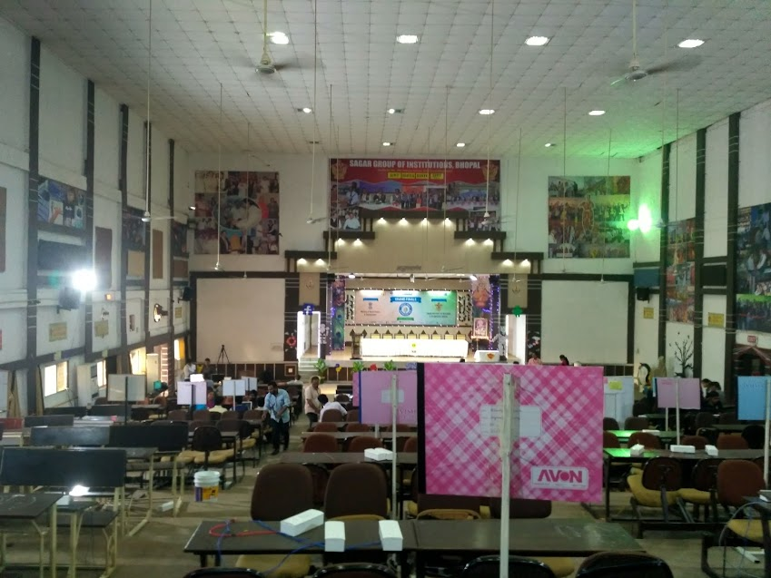

## Introduction

To promote the Digital India movement, our Hon'ble Prime Minister, Shri Narendra Modi, took a significant step and introduced SIH 2018 so that young people could participate and help solve major issues in India using their technical abilities.

We didn't know anything about SIH, but we learned about it on the MyGov website, where they mentioned that we could participate in the hackathon and contribute by solving problems. We were really excited, and after forming our team, we submitted our idea proposal on their website, as it was mandatory for selection.

## Arrival & Registration

After being selected for our first-ever hackathon, we went to our assigned center (Sagar Group of Institutions, Bhopal). On arrival, we filled in all the necessary details for the competition. We were tired after traveling, but at the same time very enthusiastic about the hackathon.

Here is an image from the registration.

## Auditorium & Setup

As soon as our documents were verified, we went to our rooms to rest and later stepped out for a quick walk. Inside the college, we admired how beautiful the campus was and soon found the auditorium where the hackathon would take place. Seeing the setup, we realized how big this event was. We quickly found our seats with our team name on them.

## Team

Our core team and mentor who made the journey special.

After that, we had a short meeting to discuss our plan and coordination, then left the auditorium and went back to our room to get some sleep.

## Day 1: Kickoff

The next day, we woke up early and went to the auditorium. We were greeted with a rose — a really kind gesture — and then we started our work there.

## Problem Statement & Approach

We had an introduction ceremony where they explained all the instructions and the hackathon timeline. While working, we were given plenty of refreshments to keep us going and coding non-stop.
Our problem statement was to create a platform where victims could file complaints against cyberbullying. As a team, we decided to build a Django web app and got to work.

## Workspace

## Through the Night & Judging

We coded through the night, taking short breaks and having coffee to stay awake. At intervals, judges visited and gave feedback, which really helped us improve our project. Both judges were kind, listened to our features, and shared reviews that we implemented later.
With so many judging criteria, we felt we were doing well. The next morning, there was a "Zumba Dance" event — a funny yet nice initiative by the SIH coordinators. We saw many people dancing and really enjoyed the moment, which kept us from feeling sleepy anymore.

<aside class="left">
    <h4>My Health</h4>
    
During the hackathon, I had a high fever and felt exhausted. I had to rest and take medicine, and later after the event it turned out to be a more serious issue.

    
</aside>

## Final Results

After this, we had one last round of evaluation where the final judge came and asked us about the project. We presented it well, but from their expressions I realized we might not win. After all the evaluations, the judges worked hard to decide the top three winners, and eventually they announced the results. We were a little disappointed — we didn’t win a position — but the learning was tremendous. Seeing so many great minds work so seriously encouraged us to try even harder next time and do something new and great.

## Final Moments

This is an image I'll always remember :')

## Bonus

While looking at the shortlist, we were 99% sure we wouldn't be selected, so we simply searched by our college name — and surprisingly, we found one result.

