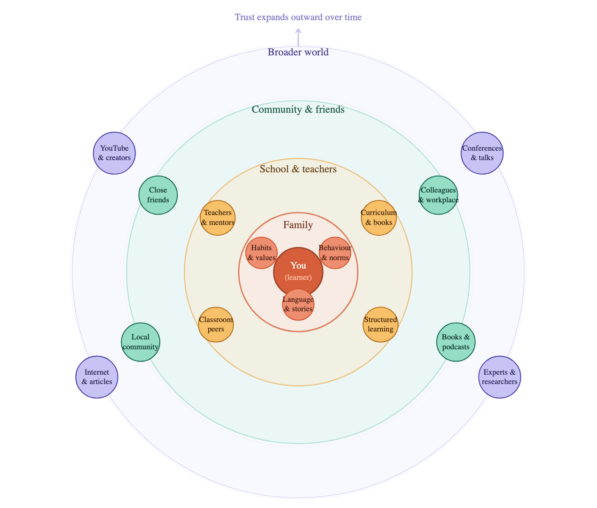
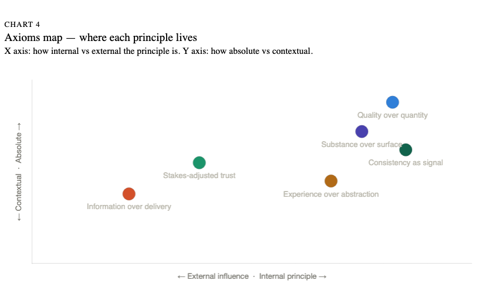
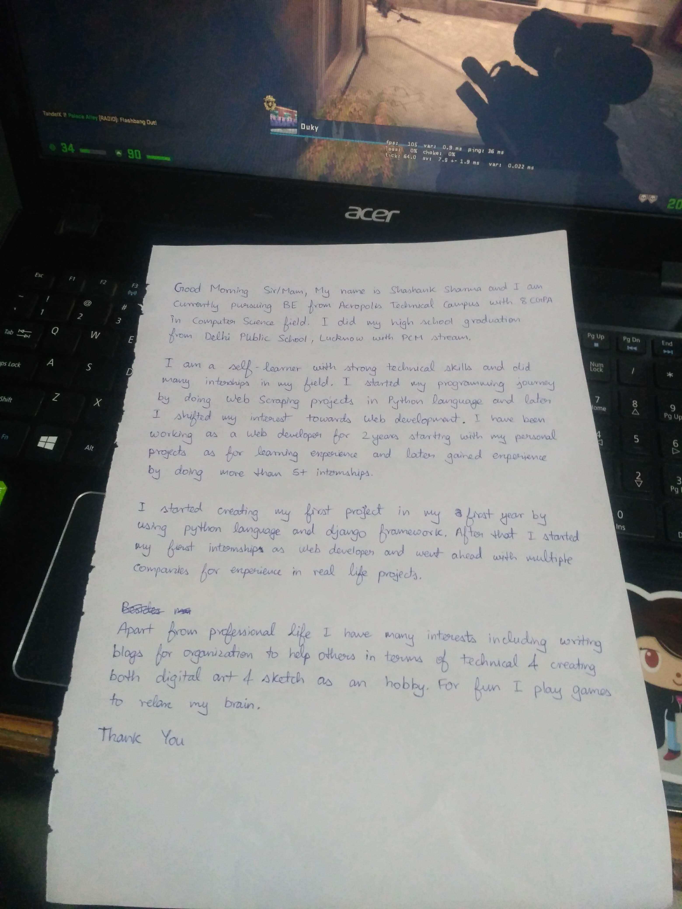


"When you are lost, where you stand is the right direction."


I wrote that line in my notes at some point. I don't remember exactly when, somewhere between my college years in Indore and the early grind of a software engineering career. I didn't fully understand it then, but I think maybe I do now.

These are my thoughts about something I've been working through for years: who do you trust, and why, and what happens to you when that trust keeps getting tested? It starts with a childhood observation about control, moves through disillusionment with the world's reward systems, and arrives at something I'm calling "the axioms of self" - a framework for building your judgment from the ground up, the way mathematicians build proofs from first principles.

Fair warning: this is not a quick read with five productivity tips at the end. It is the kind of thing you write when you've been sitting with questions long enough that they start to answer themselves, not just in a single day, but throughout my journey over the past couple of years.

This blog is about that messier version of the story and sharing my learnings

## Part I: The Problem of Control

When I was a kid, at one point in time, I concluded that: _there are things outside your control, and that is precisely what makes outcomes unpredictable_. The weather doesn't care about your plans. Other people don't behave like equations. Systems respond in ways you didn't anticipate.

But based on my original observation, I concluded: _if there are things I can't control, then the only rational strategy is to maximize what I can_. This is, in essence, the question I've been asking ever since — what all things I have control over, and how can I control them?

For example, in school life, things were way too simple, just like in math, 1 + 1 is 2. It doesn't have a bad day. Axioms are agreed upon, theorems follow logically, and the whole structure holds. But as soon as you zoom out from pure abstraction into lived experience, the number of factors affecting any outcome multiplies so fast that you lose track. Career success. Relationships. Reputation. These aren't math problems. They're messy systems with invisible variables and feedback loops you can't fully map.

So you start looking for someone who has already solved the problem. You listen.

## Part II: Learning from Others: Promise and Trap

We don't start off learning on our own. We start learning from what we're taught by our parents and other people, and there is something deeply human about trusting experienced people. It starts with what our parents teach us around habits, behaviour and more, and it expands wrt what we are taught in schools by our teachers, and we keep on going outwards — friends, conferences, YouTube videos and more. This can be better visualized as a trust ring:

Each ring only opens up if the inner ones laid a foundation of trust and that's an important insight. You can't skip rings.

The reason we have such evolution is because if someone has already walked a path and can communicate what they learned, we don't have to walk it ourselves. But after experiencing it, at some point in life, I realized there is a trap buried inside this gift, because experience is always situated.[^1] No single person can absorb everything that's out there. What actually works is knowing *who* to learn from, a handful of people whose judgment you trust, whose filters you've started to rely on.

But there's one important distinction to make here: _experience_ and _advice_ are not the same thing, even when they come from the same person. When someone describes what they actually went through, like the raw tradeoffs, the things that surprised them, that's experience being transmitted. It has weight because it is specific. When someone distills that into "do X, don't do Y," the original context strips away, and what remains applies cleanly to their situation and vaguely to yours.

I wrote in my notes once: _"If advice is all it takes to be successful, then advice will keep moving forward and should be standardized, but is that the case? No."_ If it were fully transferable, the right books and accounts would converge on a standard playbook. That is obviously not how it works. What advice can do, at best, is reduce the search space — tell you where the dead ends are. But it can't tell you where your starting point is, what resources you have, or what tradeoffs you're willing to accept. For those answers, you have to go looking somewhere else.

## Part III: The Number Game

Based on the principle I started following, which is "Quality over Quantity", I started seeking out the right resources. But there is a specific kind of illusion that sets in when you realize the loudest voices in your field are not always the most competent ones.

I started noticing patterns. LinkedIn influencers would be creating content, and the content became less about the actual work and more about the persona. Follower counts became the metric. Videos optimized for views rather than depth. Social media dramatically amplifies comparison opportunities, with users encountering constant streams of others' curated lives.[^4] And at one point I was convinced that we all are just numbers for other people. And it didn't stop at the digital world, I found myself watching people getting promoted to roles by proximity to leadership rather than impact.

And let's be honest about what it does to you. It made me angry. And then it made me cynical. And then it started to spread. I started reading other people's blogs and looking for improvements and faults instead of insights. I'd scan a well-written post and immediately think: _but they don't have real experience_. I'd see someone showcase work and think: _this is performance, not substance_. The critical eye I'd developed for evaluating quality had turned defensive, and this whole thought process felt like it was protecting me from having to sit with the discomfort of that gap between how things should work and how they actually do.

<aside class="left">
    <h4>Three Epistemic Stances</h4>
    
<strong>Trust</strong> — openness to treating others as reliable, relevant sources of information. 
    <strong>Mistrust</strong> — hypervigilance; a default suspicion that others are unreliable or self-serving. 
    <strong>Credulity</strong> — indiscriminate acceptance; trusting without filtering, even from unreliable sources. 
    Both mistrust and credulity are forms of <em>epistemic disruption</em>.

</aside>

But the more dangerous development was the shift in how I was processing information about the world. In college, I used to be so optimistic and ready to learn anything. But now, I was moving slowly from epistemic trust to _epistemic mistrust_[^2][^3] — and once that shift starts, it colours everything.

## Part IV: Finding an Anchor

Based on all these thoughts, I realized the cynicism was taking over with the reflex to tear things down instead of learn from them, the suspicion that everyone is performing, the decay of my ability to take anything at face value. That wasn't just frustration anymore. It was becoming how I processed the world. I was losing signal and this change made me question myself, why is this happening. And one day, I started asking a very basic question: how do other people address this?

I looked at someone like Linus Torvalds and wondered, does he even think about this? Does he scroll through things? How would he respond to clickbait posts? And the answer, I suspected, was no. Not because he's immune to human feeling, but because he had long ago found something to orient himself around that was more permanent than social validation.[^10] He has his principles. He had, in other words, his axioms.

That's when it clicked. Think about it this way: you wouldn't teach a dog to speak, because by principle it's not possible — it's not what a dog is. If you take a step back, any individual must have some foundational nature that determines what is even learnable, what is relevant, what aligns. Before you can decide what to learn from others, you need to know what you are.

<aside class="left">
    <h4>Self-Concept Clarity</h4>
    
A psychological construct defined as how clear, confident, and consistent an individual's beliefs about themselves actually are.[^5][^6] Low clarity means every external input competes for your attention without a filter.

</aside>

The problem I kept running into is _how do I decide what matters to me, if I'm still the person trying to figure that out?_, it feels circular, and it is, in a way. But psychology research offers a useful concept here: _self-concept clarity_. When you don't know your own axioms, every external input has the same weight. The influencer and the slow craftsperson in the corner of the internet both compete for your attention without a filter.

The math analogy that came to me, which I believe is genuinely true: _in mathematics, you cannot prove anything without first agreeing on axioms_. The entire foundation of a formal system rests on foundational statements taken as given, not because they're provably true from something else, but because they are the ground. You have to start somewhere.

Personal values work the same way. Before you can evaluate whether someone's advice is relevant to you, you need to know what you're optimizing for. Before you can decide whose experiences to weight, you need to know what domain you're operating in and what trade-offs you're willing to accept.

I had one axiom I'd been carrying without naming it for years: _quality over quantity_. I first internalized this during [Google Code-in 2015](https://developers.google.com/open-source/gci/resources/getting-started), when one of the mentors showed me and also what careful, well-structured work actually looked like and something about it just stuck. Not as an abstract preference, but as a deeply embedded response to the world. I watched quality engineers work and felt something deep inside which is respect, alignment, an almost aesthetic satisfaction. I watched the number game play out on LinkedIn and felt something else, something hollow, like an applause track.

## Part V: The Contradiction in the Axiom

I had to be honest with myself about something: where the math analogy breaks down.

In formal systems, axioms are chosen to be mutually consistent. You don't get to have contradictory axioms and still build a coherent system. Personal values, however, they are always in tension. I value quality, and I also value consistency. I value depth, and I also sometimes want reach. I believe in not showing off, and I also want my work to be seen. These don't always resolve cleanly.

The real work is not just identifying your principles — it is, as a first step but figuring out which ones hold under pressure and which ones bend. Which are absolute? Which give way in specific situations? When two of your values collide, which one wins?

I don't have a clean answer for this. That's the honest part. In math, you can detect inconsistency and fix it, like drop the axiom that breaks the system. In life, you can't drop "I want my work to speak for itself" without also losing something that feels core to who you are. But you also can't ignore the fact that the world doesn't always listen unless you speak up. The contradiction lives with you, and the best you can do is notice when it's pulling you in a direction you didn't choose.

## Part VI: The Injustice Problem

Let me be direct about something I've experienced that I haven't seen talked about enough:

> the psychological cost of witnessing unfairness you cannot fix.

There was a moment few years back, when my manager kept promising a promotion. He said the words, repeatedly. I had no reason not to believe him, I was doing the work, shipping high-impact results, and he acknowledged it in our 1-on-1s. Then came the meeting with the higher-ups. Instead of making a structured case for my promotion, instead of summarizing my contributions, he went off on tangents about team processes, brought up projects I wasn't even involved in, and never once mentioned the high-impact work I'd shipped. It wasn't advocacy. It was filler. My potential was neglected right there.

That didn't just frustrate me, it destabilized a framework I'd relied on. I had been operating under a kind of implicit social contract: if I do good work, consistently, at high impact, it will be recognized. That contract was violated.[^8][^9] And the violation wasn't just about the promotion itself. It was about the information it transmitted about how the system works.

<aside>
    <h4>The Meritocracy Paradox</h4>
    
Organizations that most loudly espouse meritocracy often display the greatest bias, because managers pay less attention to their own biases when they believe the system is already "fair."[^7]

</aside>

You don't keep contributing to a game that is rigged against your strategy. But the deeper damage is to my understanding. If the system doesn't reward what I thought it rewarded, then my model of the system is wrong. And if my model is wrong, what else is wrong?

I resigned. Not in a dramatic, burn-the-bridge way, I just realized there was no point staying somewhere the foundation didn't hold. And what I learned wasn't about the manager or the meeting. It was that a system's stated values and its revealed values can be entirely different things, and if you wait for the system to tell you which one is real, you'll wait forever.

The antidote, I think, is not to restore naive trust but to build selective trust grounded in principles. To ask: whose interests are aligned with honesty here? Whose experience maps onto my constraints? Who is describing what actually happened rather than what sounds good?

## Part VII: The Rubric Paradox

At Coursera, I encountered the opposite of what I'd left behind. There was structure, an explicit rubric for what "Senior Engineer" means. Clear expectations, documented criteria, a process. After the chaos, where promotion lived and died by proximity, this looked like the fix. Finally, a system that rewards the work itself.

I had always operated on a simple belief: do quality work, and let the work speak. I shouldn't have to campaign for recognition, if the impact is real, people around me will see it. That belief ran deep, close to the bone. And the rubric asked me to do something that felt like its opposite: document your impact, narrate your contributions, make your case visible. Earlier in Part V, I wrote that I believe in not showing off while also wanting my work to be seen, and this was exactly where that contradiction stopped being abstract and became a daily decision.

And to be fair, some of what the rubric pushed me toward was genuinely valuable. Being more vocal in discussions, taking design doc reviews seriously, making my reasoning visible to the team rather than just shipping quietly. These weren't promotion theater. They made me a better engineer. The rubric, at its best, was naming behaviors that actually matter at the senior level, things I might have undervalued if left to my own instincts alone.

<aside>
    <h4>Goodhart's Law</h4>
    
A known principle in measurement theory: <em>"When a measure becomes a target, it ceases to be a good measure."</em> Originally about monetary policy, it applies wherever structured metrics exist.

</aside>

So the rubric itself had real value, I'd seen what happens without one.

I ended up partially playing the game. I documented my impact. I made my contributions legible in the language the rubric understood. But I didn't let the rubric decide what I worked on. When something needed doing and it wasn't rubric-visible, I did it anyway, and figured out how to frame it later. The rubric became a communication tool, here's what I did and why it mattered.

I'm still working through this tension, between the rubric as a genuine mirror and the rubric as a game to be optimized. I don't think there's a clean resolution. But the question itself has become part of how I evaluate any structured system: _is this measuring what it claims to measure, or has the measure become the point?_

## Part VIII: Stakes Change Everything

Stakes are massively underappreciated in how we evaluate advice and experience. I first noticed this in gaming. I'd reached peak rank in competitive games playing casually every night — late sessions, music on, no pressure. I knew the mechanics cold. Then I entered a tournament where the matches actually mattered, and I was a completely different player. I'd hesitate on decisions I'd make instinctively in ranked. I'd overthink plays that should be automatic. I lost to people I'd have beaten on any normal night. The skill was the same; the pressure exposed everything that ranked games never tested.

That distinction between low-stakes competence and high-stakes performance, applies far beyond gaming. When someone tells you what worked for them, they're usually not telling you the stakes they were operating under. The engineer who took big risks at a startup was operating under a different constraint set than someone who has dependents and a mortgage. The person who tweets confidently about career decisions is usually not factoring in what they would have done if those decisions had failed.

Whether you see someone else's success as a threat or a signal depends on where you are in your own journey.[^11] Your mindset, your life stage, your current obligations, these aren't background noise. They're the frame inside which any strategy has to operate.

My decision to resign was rational for me, I was 25, no dependents, and the cost of staying was higher than the cost of leaving. Someone else, with a family counting on that paycheck, might have reasonably stayed and fought the system from inside. That's not weakness. That's a different set of stakes producing a different optimal move.

This is why I've started treating advice with a question rather than a verdict: _under what conditions did this work, and do those conditions apply to me?_ Not a reflexive distrust, but a requirements check.

## Part IX: Consistency, Invisibility, and the Real Compound Interest

Here is something I believe and have watched be true: _consistency is deeply invisible until it isn't._

I've been writing this blog since college. For years, almost nobody read it. No comments, no shares, no feedback loop telling me it was worth the hours. I wrote a post about RGPV exam vulnerabilities that took weeks of research and it got a handful of views. I wrote analyses of transportation data that I genuinely thought were interesting, same thing. There was no moment where the effort felt validated by an audience. And yet, when I sat down to write this piece, I could feel the difference that those years of practice had made. The structure came faster. The arguments held tighter. The ability to sit with a draft for days instead of publishing something half-formed, that's not talent, that's what happens when you've done it badly enough times to know what "done well" feels like.

That invisibility is part of why the number game wins in the short run. Follower counts are immediately legible. Five years of compounding expertise is not. The platform optimizes for what it can measure, and what it can measure tends to be shallow.

You often can't see what you're building while you're building it. The metric of progress is internal, a growing sense of capability, of knowing more about a domain than you did before, of being able to solve problems you couldn't before.

<aside class="left">
    <h4>Self-Determination Theory</h4>
    
Ryan and Deci distinguish between <em>autonomous motivation</em> (driven by genuine interest) and <em>controlled motivation</em> (driven by external pressure). The former sustains effort longer and produces better outcomes.[^12]

</aside>

This is what the craftsperson has that the influencer doesn't: an integrated relationship with their work. The work and the self are not separate. Which means the metric of "is this working?" is also internal and you can feel it. When your drive comes from genuine interest rather than external pressure, you don't need the scoreboard to tell you whether you're making progress.

## Part X: Towards My Personal Axioms

If I had to make concrete what I've been building toward:

I am working on a system for deciding what to believe and who to trust, customized to my principles, constraints, and goals. My current working version looks roughly like this:

*Axiom 1*: **Substance over volume.** I am not interested in quantity for its own sake in follower counts, in shipped features as performance of productivity, in personas that outshine the work they're attached to. I care about whether the thing is good, and whether it can stand on its own without the brand around it.

*Axiom 2*: **Stakes-adjusted trust.** I try to understand the conditions under which someone's advice was generated before deciding how much it applies to me. The same career move can be rational in one context and irrational in another.

*Axiom 3*: **Experience over abstraction.** I value people describing what actually happened more than people describing what should happen. The former has texture. The latter is often theory cosplaying as wisdom.

*Axiom 4*: **Consistency as signal.** I take seriously people who have been doing something for a long time without necessarily being rewarded for it in legible ways. If you take away my titles or my "numbers," my consistency remains. That is what I care about.

*Axiom 5*: **Information over delivery.** The "Art of Listening" is a skill. We often judge people for how they speak — their background, their "funny" accent, or their "showy" attitude. But I've learned to focus on the information, not the communication. If someone has a piece of the puzzle, I will take it.

*Axiom 6*: **Data over narrative.** I trust a well-constructed metric over a well-constructed story, not because numbers are infallible, but because they're harder to unconsciously bend toward what you want to be true. Narrative explains; data constrains.

The goal isn't perfection. The goal is stability: a stable enough foundation that new information can be evaluated rather than just absorbed or rejected.

## Conclusion: Schrödinger's Thoughts

> "My thoughts are nothing but like a Schrödinger's cat, they exist in my mind. I know I can, but it's not there enough to prove anything."

There's a kind of knowledge that exists before proof. You know you can write well before anyone has read your best writing. You know you can solve the problem before you've solved it. That interior sense is real, even when it's unverifiable from the outside.

As kids, we were allowed to make mistakes to learn. Somewhere in adulthood, we stop allowing ourselves that grace too busy trying to inherit the filtered experiences of others, too worried about efficiency to go through the slow version ourselves. But the slow version is where the axioms form. Not from advice, not from frameworks, but from actually doing the thing.

I'm going back to the foundational math. I will accept the constants in my life but remain flexible enough to change my variables. I will focus on the quality of my output, even when the numbers don't match the influencers.

Because the direction you're looking for is not out there. It starts from where you are.

## Bonus

This is a self-introduction I wrote in my second year of college, February 2019, I didn't know what I was building toward. I just kept going and seven years later, I'm still writing. Still playing games. The tech has changed. The consistency hasn't.

[^1]: Beyond Mentalizing: Epistemic Trust and the Transmission of Culture: https://www.tandfonline.com/doi/full/10.1080/00332828.2023.2290023

[^2]: Epistemic trust: a comprehensive review of empirical insights and implications for developmental psychopathology: https://www.researchinpsychotherapy.org/rpsy/article/view/704

[^3]: How epistemic trust, mistrust and credulity relate to mental health: https://pmc.ncbi.nlm.nih.gov/articles/PMC12820883/

[^4]: A theory of social comparison processes: https://journals.sagepub.com/doi/10.1177/001872675400700202

[^5]: Self-concept differentiation and self-concept clarity: https://www.sciencedirect.com/science/article/abs/pii/S0191886916308145

[^6]: Identities: A developmental social-psychological perspective: https://www.tandfonline.com/doi/full/10.1080/10463283.2022.2104987

[^7]: The Paradox of Meritocracy in Organizations: https://journals.sagepub.com/doi/10.2189/asqu.2010.55.4.543

[^8]: When Employees Feel Betrayed - A Model of How Psychological Contract Violation Develops: https://journals.aom.org/doi/10.5465/amr.1997.9707180265

[^9]: The Impact of Psychological Contract Breach on Work-Related Outcomes: https://onlinelibrary.wiley.com/doi/10.1111/j.1744-6570.2007.00087.x

[^10]: Linus Torvalds - The mind behind Linux (TED): https://www.ted.com/talks/linus_torvalds_the_mind_behind_linux

[^11]: Mindset - The New Psychology of Success: https://www.penguinrandomhouse.com/books/44330/mindset-by-carol-s-dweck-phd/

[^12]: Intrinsic and Extrinsic Motivations - Classic Definitions and New Directions: https://selfdeterminationtheory.org/SDT/documents/2000_RyanDeci_IntExtDefs.pdf

{{< time-mountain data="[{\"date\": \"10 Mar\", \"hours\": 0, \"position\": 10}, {\"date\": \"11 Mar\", \"hours\": 0, \"position\": 23}, {\"date\": \"12 Mar\", \"hours\": 0, \"position\": 37}, {\"date\": \"13 Mar\", \"hours\": 0, \"position\": 50}, {\"date\": \"14 Mar\", \"hours\": 0.8, \"position\": 63}, {\"date\": \"15 Mar\", \"hours\": 3.95, \"position\": 77}, {\"date\": \"16 Mar\", \"hours\": 0.46, \"position\": 90}]" >}}