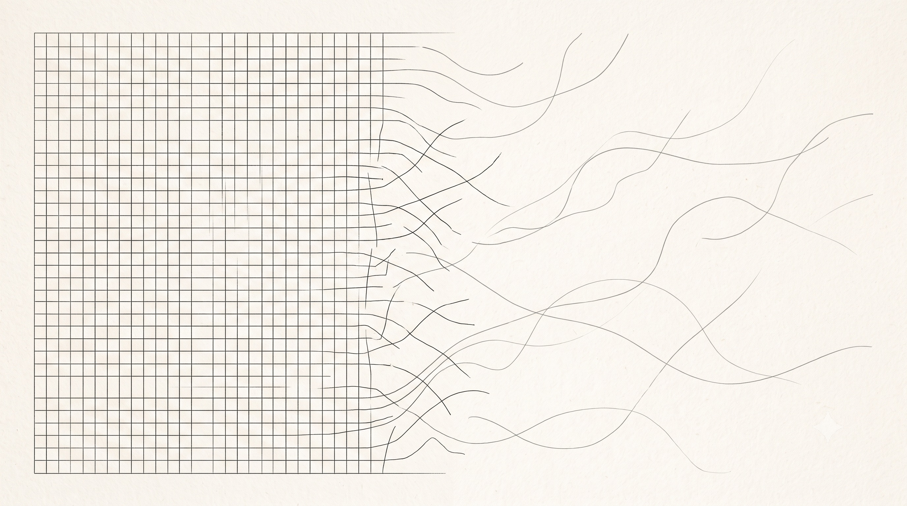


"The limits of my experience are not the limits of what is possible."


I have spent a considerable amount of time trying to understand how I think.

Not just what I believe, but why I believe it.

Over time, I started noticing patterns in how I process information, how I form opinions, how I trust people, and how I react when something doesn't fit the model I already have in my head.

That eventually led me to write [The Axioms of Self]().

The idea was relatively simple. We all receive an enormous amount of information from the world, but not all information deserves equal trust. Experiences are situated. Advice is contextual. People optimize for different things. What worked for someone else does not automatically become a universal truth. So I tried to build a framework that would help me evaluate things rather than simply absorb them.

But there was something I hadn't considered.

The framework works reasonably well when the thing I am trying to understand is an idea. It becomes much harder when the thing I am trying to understand is another person. Because unlike an idea, another person comes with a completely different dataset. And sometimes, the most difficult thing to accept is that their dataset does not have to resemble mine.

## Part I: The Invisible Reference Point

We all have reference points. Most of the time, we don't notice them.

The way your family communicates becomes your idea of how families communicate. The way your friends behave becomes your idea of friendship. The way you deal with conflict becomes your idea of what dealing with conflict looks like. The way you express affection becomes your idea of what affection feels like.

None of this is necessarily conscious. You experience something repeatedly, and eventually your brain stops treating it as one possible model and starts treating it as the default.

This is useful. We need reference points. Without them, every experience would require completely new reasoning. But there is a subtle problem.

> A reference point is useful for orientation, but dangerous when mistaken for reality itself.

If I have only ever experienced one kind of relationship, I will naturally use that relationship as the baseline for interpreting other relationships. If someone communicates more openly than I do, I might perceive them as oversharing. If someone communicates less, I might perceive them as distant. If someone spends a lot of time with their family, I might interpret it differently from someone who grew up in a very independent family. If someone makes decisions collectively, I might interpret it differently from someone who has always made decisions independently.

The behaviour is the same. The interpretation changes. And often, the difference isn't in the behaviour. It is in the observer.

## Part II: When Familiar Becomes Normal

There is something interesting about familiarity. We rarely call familiar things "a particular way of doing things." We just call them normal. This happens because repeated exposure removes the feeling of novelty.

Imagine growing up in a family where people discuss everything openly. You might grow up believing: *"Of course families talk about these things."* Someone else might grow up in a family where personal matters are rarely discussed. They might grow up believing: *"Of course families have boundaries around these things."*

Both people can enter adulthood with completely different definitions of what is normal. Neither necessarily chose their definition. Their environment chose the initial conditions.

And this is not limited to families. It happens with money, ambition, education, friendship, relationships, work, conflict, privacy, success, failure, communication, independence — the list keeps going.

We carry our previous environments into new environments. The problem is that we don't always carry them as experiences. We carry them as assumptions. That distinction matters, because saying *"This is how I have experienced it"* is very different from saying *"This is how it is."*

## Part III: The Missing Reference Point

I think a lot of misunderstanding comes from something I would call the **reference point problem**.

You encounter a behaviour that you have never experienced before. You don't have enough context to immediately understand it. So your brain searches for the closest thing it knows, lands on the nearest match, compares, and interprets. That entire loop runs before you've even noticed it happened.

It is an efficient system. It is also an imperfect one, because sometimes the closest reference point is not actually relevant.

A person might behave differently from you because they have different experiences, not because they have a different value system. A person might make a different decision because they are optimizing for something different, not because they are being irrational. A person might have a different relationship with their family, friends, work, or partner because those relationships themselves have different histories, not because one relationship is healthier and the other is broken.

The mistake happens when we take *"I don't understand this"* and unconsciously convert it into *"There must be something wrong with this."* Those are two completely different conclusions.

## Part IV: Unfamiliarity Feels Like Error

I think there is a reason this happens so easily. Our brains are constantly trying to reduce uncertainty. When something doesn't fit our existing model, there is tension. We want an explanation. And when we don't have enough information, we create one. This is where narrative enters.

Consider a simple observation: someone behaves differently from what you expected. The observation itself is relatively neutral. But very quickly, the mind can generate: *"Maybe they don't care."* Or: *"Maybe they are hiding something."* Or: *"Maybe they are being irrational."* Or: *"Maybe they don't respect the same things I do."*

These explanations may be true. But they are only hypotheses. The problem is that emotionally relevant hypotheses often feel like conclusions. Once a story has been generated, we start collecting evidence around it. A single event becomes a pattern. A pattern becomes a belief. And eventually, the belief becomes part of the model through which we interpret every future event.

This is one of the reasons I keep coming back to the distinction between *data and narrative*. The data may be real. The narrative is still something we constructed.

## Part V: Emotion Is Not Evidence

There is another layer that makes this particularly difficult.

Sometimes the interpretation produces an emotion. And once we feel something strongly, it becomes tempting to treat the feeling itself as evidence that the interpretation must be correct. Something feels wrong. Therefore something must be wrong. But that isn't necessarily true.

An emotion can be completely real while the explanation attached to it is incorrect. Fear can be real without danger being present. Insecurity can be real without rejection occurring. Discomfort can be real without a boundary being violated. Confusion can be real without someone doing something wrong.

This doesn't mean emotions should be ignored. Quite the opposite, they are useful signals. But a signal and a conclusion are not the same thing. I think a useful distinction is:

> Emotion is information, but it is not instruction.

If something makes me uncomfortable, I should pay attention to it. But I don't necessarily need to act on the first explanation my mind produces. There is a gap between feeling something, interpreting it, believing the interpretation, and acting on it. Perhaps that gap is where a lot of maturity is built.

## Part VI: The Problem With Self-Comparison

There is another form of the same problem that I notice often. We compare other people's relationships, careers, families, habits, or decisions to our own. Comparison itself isn't bad, it can be useful, it gives us information. The problem is that we often compare **outcomes without comparing initial conditions**.

Two people can have very different relationships with their siblings because they grew up differently. Two people can have very different careers because they have different constraints. Two people can have very different financial behaviours because they learned different relationships with money. Two people can have different definitions of success because they are optimizing for different things.

The comparison becomes misleading when we look at a different outcome and assume one of the systems must be wrong, when the reality might simply be that different inputs produced different internal models, which produced different outcomes.

This doesn't mean every behaviour should be accepted. Some behaviours are genuinely harmful. Some boundaries genuinely should exist. Some decisions genuinely are irrational. The point is not to become so relativistic that nothing can be evaluated. The point is to understand the system before evaluating its output.

## Part VII: Understanding Is Not Agreement

This is perhaps the most important distinction I have been thinking about. Understanding someone does not mean agreeing with them.

I can understand why someone values stability more than ambition without adopting their priorities. I can understand why someone needs a lot of social connection without needing the same amount myself. I can understand why someone communicates differently without communicating the same way. I can understand someone's reasoning without accepting their conclusion.

This sounds obvious. But in practice, I think we often skip the understanding step. We see a behaviour. We evaluate it using our own assumptions. And then we judge the person. The missing step is:

> What would have to be true about this person's experience for their behaviour to make sense?

That question is powerful because it changes the task. Instead of asking *"why would anyone do this?"*, you start asking *"what context am I missing?"* That doesn't guarantee the behaviour will make sense. But it creates room for it to.

## Part VIII: A Framework for Unfamiliar Things

I have been trying to think about this as a small process. When I encounter something that feels wrong, strange, or difficult to understand, I want to separate five things.

**1. Observation.** What actually happened, without interpretation, just the event.

**2. Reference point.** What am I comparing this against? Is my comparison based on experience, evidence, or simply familiarity?

**3. Interpretation.** What story did my mind create to explain what happened?

**4. Alternatives.** What are other explanations that could also fit the same data?

**5. Evidence.** What additional information would distinguish between those explanations?

This sounds very analytical. Maybe it is. But I think that's useful precisely because emotions can compress these five steps into one: something happens, we feel something, we explain it, we believe the explanation, and then we behave as though the explanation were a fact. Creating even a small amount of separation between those steps changes the quality of the decision.

## Part IX: The Limits of My Own Experience

This is probably the part I am finding hardest to internalize.

I have spent a lot of time trying to understand myself, and I think that is valuable. But there is a danger in becoming too good at explaining yourself. You start believing that because you understand your own internal model, you can use it to explain everyone else. You can't.

My experience can explain why *I* think the way I think. It cannot fully explain why someone else thinks the way they do. It can give me hypotheses. It can give me questions. It can help me identify where our models differ. But it cannot become their internal model.

And maybe that is one of the limits of self-knowledge. The better I understand myself, the more clearly I should be able to see where *myself ends*. Understanding myself should not make the world smaller. It should make me more aware of how much of the world exists outside my experience.

> Maybe growth isn't drawing a bigger map. Maybe it's remembering the map was never the world.

## Part X: Differentiation

There is a concept I have found particularly interesting while thinking about this: differentiation. The basic idea, at least in the way I find it useful, is that people can remain connected without becoming psychologically identical.

You can be close to someone without needing them to think like you. You can disagree without needing distance. You can maintain boundaries without disconnecting. You can care deeply about someone without treating their differences as threats to your own identity.

I think this is especially important in relationships. The goal of closeness isn't necessarily to eliminate difference. If anything, perhaps a mature form of closeness allows more difference to exist. Two people can have different families, different experiences, different emotional needs, different communication styles, different reference points, and still build something meaningful together.

The challenge isn't removing those differences. The challenge is developing enough stability within yourself that difference doesn't automatically become threat.

## Part XI: A New Set of Axioms

The previous essay was an attempt to define some principles for how I want to think. I think this experience has added another layer to those principles.

*Axiom 1*: **Familiarity is not universality.** Something being normal to me only tells me that it is normal within my experience.

*Axiom 2*: **Difference is not evidence of error.** A different way of behaving, communicating, or relating is not automatically an incorrect one.

*Axiom 3*: **My experience is a reference point, not a specification.** My past can help me interpret the present, but it should not dictate what the present is allowed to be.

*Axiom 4*: **Emotion is information, not instruction.** A feeling deserves attention without automatically deserving obedience.

*Axiom 5*: **Observation and interpretation must remain separate.** What happened is not the same as what I think it means.

*Axiom 6*: **Understanding does not require agreement.** I can understand a system without adopting it.

*Axiom 7*: **A strong internal framework must remain flexible.** If a framework cannot accommodate experiences outside the boundaries of its creator's experience, it is not a framework for reality. It is a framework for familiarity.

*Axiom 8*: **Not every uncertainty is a problem to solve.** Some uncertainties are conditions to live inside.

> Not everything unfamiliar is asking to be solved. Some of it is only asking to be witnessed.

## Conclusion: Beyond the Self

The first version of this thinking was about building a stronger internal foundation. I wanted to know what I could trust. What information deserved attention. What experiences were relevant. What beliefs were actually mine.

I still think those questions matter. But I think there is another question that follows naturally from them: once I have built a model of myself, how do I avoid using that model as a definition of everyone else?

Maybe the next stage of self-awareness isn't simply understanding yourself better. Maybe it is understanding the limits of your own reference points.

There will always be things that feel strange because we haven't experienced them. There will always be people whose internal worlds don't resemble ours. There will always be behaviours that initially make no sense. And perhaps the mature response isn't immediate acceptance. It isn't immediate rejection either. It is curiosity — the ability to say *"I don't understand this yet"* without immediately adding *"therefore something is wrong."*

That distinction seems small. But I think it changes a lot. Because the world does not become more understandable simply because I build a better model of it. Sometimes the world becomes more understandable when I stop insisting that my model has to be the whole of it.

And perhaps that is the next step after building the axioms of self: to know yourself well enough to trust your perspective, but not so rigidly that you mistake your perspective for reality itself.

> The map was never meant to be the territory. It was only ever meant to get you there and back.
