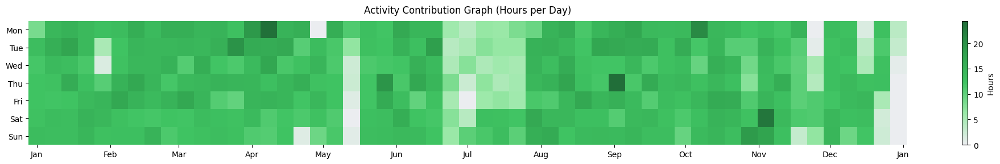
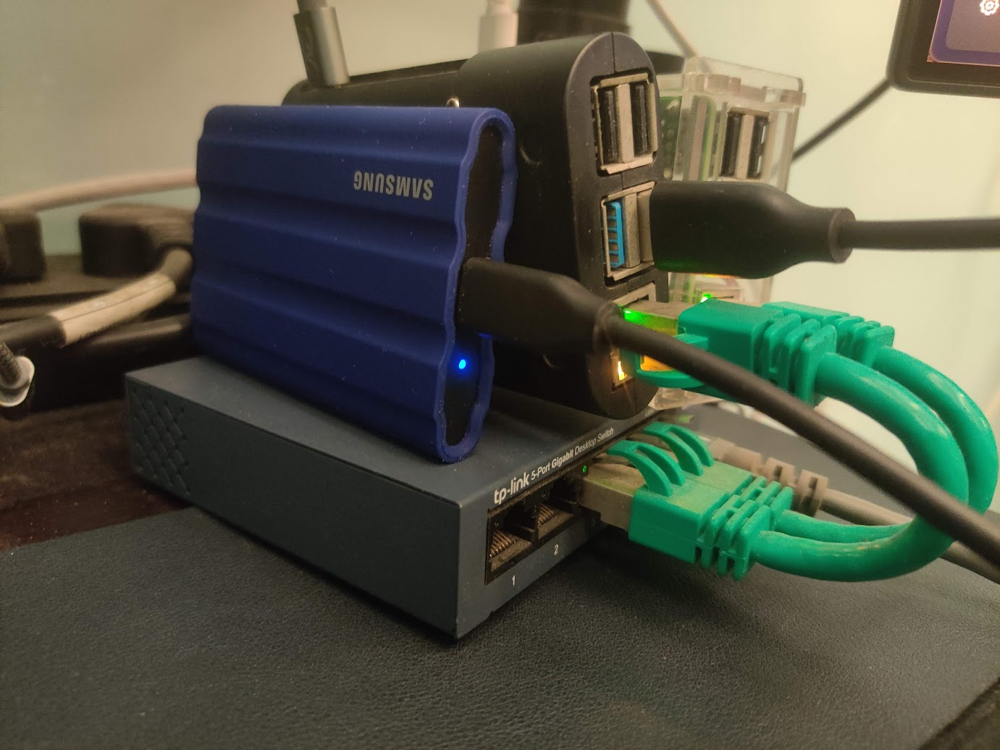
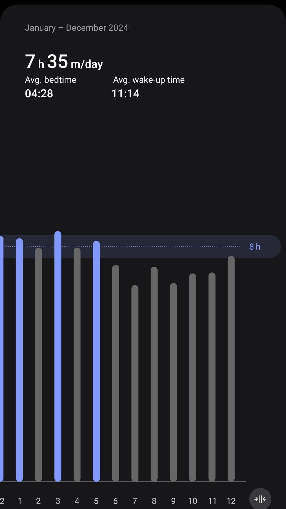
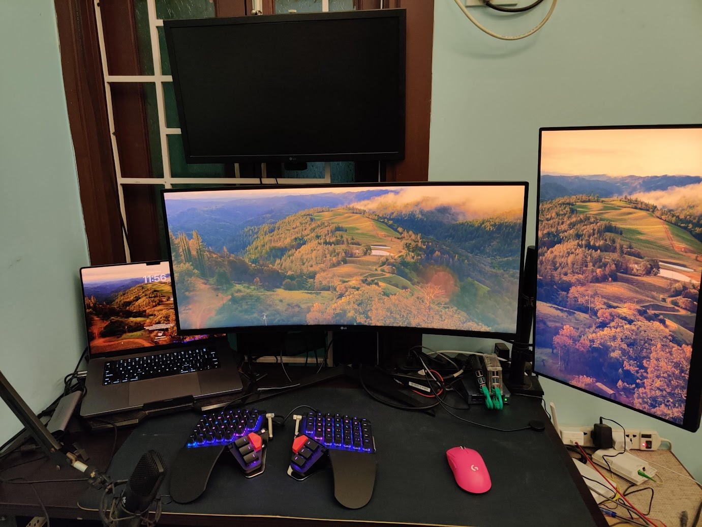
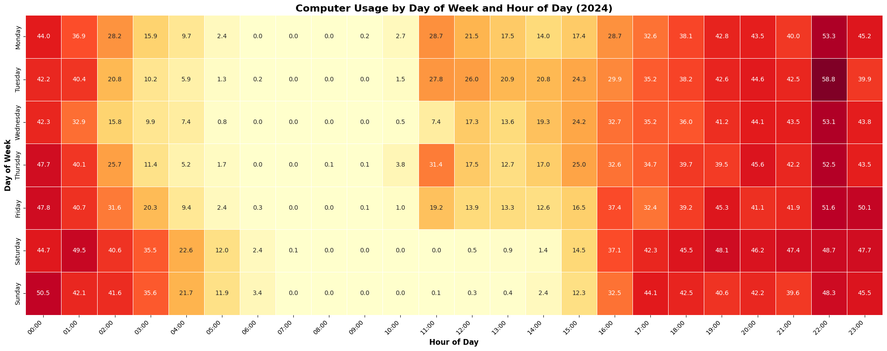
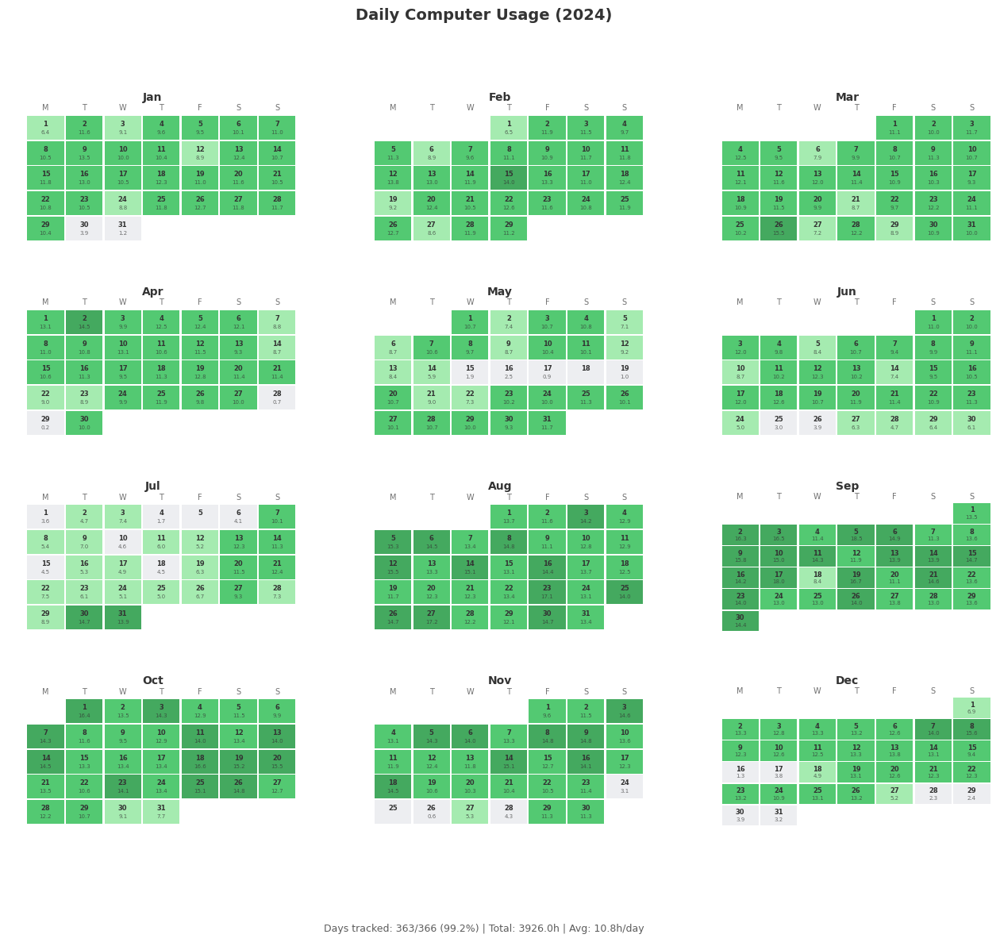

## Introduction

<aside class="left">
    <h4>Server Status</h2>
    
As of now all my server/services status can be seen at self hosted <a href="https://status.shashanksharma.xyz">status page</a>

</aside>

This year has been exciting wrt me joining at Coursera, learning java as a completely new languague, which I never thought I'll be making use of given I have been priamrily working with Python and Golang. Besides that, I did enjoyed picking new hobby, which in this case was is selfhosting. I finally made use of my raspberry pi and deployed couple of useful tools and taking first step towards homelab setup

## Sleep Schedule

My sleeping schedule has been messed up when I was working at Hackerrank, and I believe it peaked in Coursera where I have been coding/doing focus time work at night and sleeping way too late. Even though I was getting approx 8hrs of sleep, I was sacrificing alot wrt skipping breakfast, having random snacks at night etc, and as per my sleeping stats, you can easily see how bad it was:

## Workstation

<aside>
    <h4>Gear from amazon</h4>
    
Monitor: <a href="https://www.amazon.in/dp/B0C61NNG55" target="_blank">Link</a>

    
Mouse: <a href="https://www.amazon.in/dp/B0CT8KVMWC" target="_blank">Link</a>

    
SSD: <a href="https://www.amazon.in/dp/B09YHPP1R9" target="_blank">Link</a>

    
Switch: <a href="https://www.amazon.in/dp/B07RPVQY62" target="_blank">Link</a>

    
15cm Ethernet: <a href="https://www.amazon.in/dp/B0C1ZGXWY3" target="_blank">Link</a>

    
Extension: <a href="https://www.amazon.in/dp/B09RH4GCDY" target="_blank">Link</a>

    
Window mount: <a href="https://www.amazon.in/dp/B07YX649HS" target="_blank">Link</a>

</aside>

Obviously, joining a new company comes with good benifits, and in this case, I purchased [MoonLander](https://www.zsa.io/moonlander) which is super awesome btw, and troubled me a lot, because given it's a columnar keyboard, I had to train my brain first, but once I got used to it, I can clearly see myself reaching 100 WPM without stressing my hand too much.

## Hourly distribution of my time

No meetings wednesday, In my team at Coursera, wednesday is usually no meeting day, which means standup updates happen async and because of which if you notice, my working hours at 11:00 is less compared to other week days.

My usual day looks like waking up before 11:00 and making sure to be available for standup, hence according to this heatmap, my work usually starts by 11:00. Also in this graph as well, you can see how messed up my sleeping schedule was.

## Laptop usage per day

This year I have been very much active except few selected days, where I either had to attend some family function or I was out with friends. Overall in total, I spent around 3926 hours which is excluding idle time.

All my visualization can be seen at [Python Notebook](/notebooks/2024-review/)