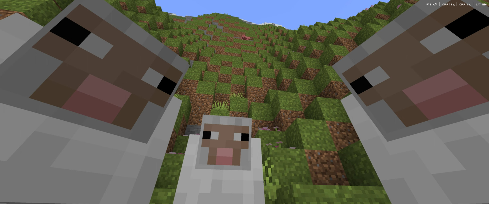

## Our First Step

Minecraft Season 1 was our first step towards playing minecraft in a multiplayer environment, hosted in our instance, and thanks to [TheIndianOtaku](https://github.com/theindianotaku) for all the modding, we were able to enjoy minecraft with a whole new experience.

## Experiences

### Taking break before going to an Adventure



### Checking onto your friends during an Adventure



### Or turning against each other, and fighting



<aside class="left">

There are couple of experiences like this, you can find here at: <a href="https://gaming.shashanksharma.xyz">gaming.shashanksharma.xyz</a> or head over to my season 2 for more: <a href="/worlds/minecraft-season-2/">Here</a>

</aside>