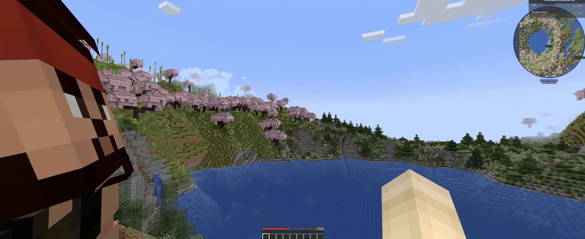

## Why Season 2

Season 1 that time felt like we explored more than enough, and we achieved a couple of things, hence we started to try some new mods and that is where we started this new instance. In this season, I committed good amount of time building structures based of Japanese theme and explored a lot.

## Experiences

### Have a look at folks randomly having tea break



### Intrusive thoughts taking over for literally no reason



## Some Experiences beyond Season 2:

### Making things to Enjoy it together



### My Gift to Spunk:



### Visiting friends new place



### Interacting with NPCs



### Skeleton Farm Mishap



<aside class="left">

There are couple of experiences like this, you can find here at: <a href="https://gaming.shashanksharma.xyz">gaming.shashanksharma.xyz</a>

</aside>